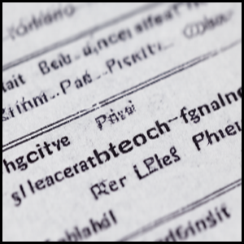
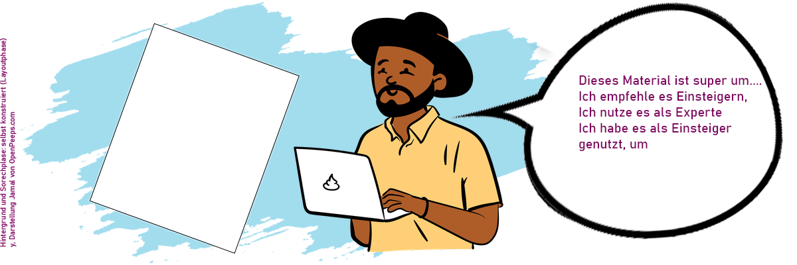

<!--
author:   Your Name

email:    your@mail.org

icon:     img/icon.png

version:  0.0.1

language: de

narrator: US English Female

comment:  Try to write a short comment about
          your course, multiline is also okay.

link:     style.css

script:   https://cdnjs.cloudflare.com/ajax/libs/PapaParse/5.3.1/papaparse.min.js

@onload

const baseURL = (new URL("img", window.location.search.substr(1))).href

window["fish"] = {
  "body.typical": null,
  "body.flattened": null,
  "body.long": null,

  "mouth.inferior": null,
  "mouth.superior": null,
  "mouth.elongated": null,
  "mouth.terminal": null,

  "barbel.one": null,
  "barbel.several": null,
  "barbel.absent": null,

  "sucking_disc.present": null,
  "sucking_disc.absent": null,

  "color.black": null,
  "color.blue": null,
  "color.brown": null,
  "color.green": null,
  "color.grey": null,
  "color.red": null,
  "color.silver": null,
  "color.white": null,
  "color.yellow": null,

  "pattern.circles": null,
  "pattern.dots": null,
  "pattern.irregular": null,
  "pattern.spots": null,
  "pattern.stripes": null,
  "pattern.uniform": null,

  "fin.dorsal.one": null,
  "fin.dorsal.two": null,
  "fin.dorsal.three": null,
  "fin.dorsal.with_adipose": null,
  "fin.dorsal.with_finlets": null,
  "fin.dorsal.with_spines": null,

  "fin.pelvic.pelvic": null,
  "fin.pelvic.pectoral": null,
  "fin.pelvic.jugular": null,
  "fin.pelvic.absent": null,

  "fin.caudal.forked": null,
  "fin.caudal.straight": null,
  "fin.caudal.rounded": null,
  "fin.caudal.pointed": null,
  "fin.caudal.not_symmetric": null,
}

window["button"] = function(title, active, image) {
  const color = active ? '#f0842c' : "black" 
  return `

    <h4>${title}</h4>
    
  
`
}

window.fish_filter = function() {
  if (window.fish) {
    let items = []
    for (const [item, selected] of Object.entries(window.fish)) {
      if (selected) {
        items.push(item)
      }
    }

    let result_often = []
    let result_seldom = []

    for (const fish of window.fish_db) {      
      let rslt = true

      for (const item of items) {
        if (!fish[item]) {
          rslt = false
          break
        }
      }

      if (rslt) {
        console.log("ssssssssssssssssss", fish["amount.often"])
        if (fish["amount.often"]) {
          result_often.push(fish.name)
        } else {
          result_seldom.push(fish.name)
        }
      }
    }

    const div = document.getElementById("results")

    if (div) {
      let list = ""

      if (result_often.length > 0) {
        list += " <h3>Häufig und regelmäßig in der Ostsee</h3>"
      }

      for(const fish of result_often) {
        let url = fish.toLocaleLowerCase().replace(/ /g, "-")
        let url_ = 
        list += `<a style="display: inline-flex; padding: 1rem; margin: 1rem; border: 1px solid black" href="#${url}"><h4>${fish}</h4></a>`
      }

      if (result_seldom.length > 0) {
        list += "<h3>Selten und als Irrgast in der Ostsee</h3>"
      }

      for(const fish of result_seldom) {
        let url = fish.toLocaleLowerCase().replace(/ /g, "-")
        let url_ = 
        list += `<a style="display: inline-flex; padding: 1rem; margin: 1rem; border: 1px solid black" href="#${url}"><h4>${fish}</h4></a>`
      }

      div.innerHTML = list
    }
  }
}

const CSV=`name,color.green,fin.dorsal.two,fin.dorsal.with_adipose,fin.caudal.forked,color.red,amount.often,pattern.uniform,color.brown,fin.dorsal.one,fin.pelvic.jugular,barbel.absent,fin.dorsal.with_spines,body.typical,color.silver,mouth.superior,body.flattened,pattern.dots,fin.dorsal.three,pattern.irregular,sucking_disc.present,fin.pelvic.pelvic,color.black,fin.caudal.pointed,fin.caudal.not_symetric,fin.pelvic.pectoral,color.grey,mouth.terminal,fin.caudal.straight,color.blue,pattern.spots,sucking_disc.absent,body.long,barbel.one,fin.pelvic.absent,fin.caudal.rounded,pattern.circles,color.yellow,mouth.elongated,pattern.stripes,fin.dorsal.with_finlets,mouth.inferior,barbel.several,color.white
Aal,,,,,,true,true,true,true,,true,,,true,true,,,,,,,true,true,,,true,true,,,,true,true,,true,,,true,,,,,,true
Aalmutter,,,,,,true,,true,true,true,true,,,,,,,,,,,true,true,,,true,true,,,true,true,true,,,,,true,,true,,,,
Adlerfisch,,true,,,,false,true,true,true,,true,,true,true,,,,,,,,true,,,true,true,true,true,,,true,,,,,,,,,,,,
Ährenfisch,,true,,true,,true,true,,,,true,,true,true,true,,,,,,,,,,true,,,,true,,true,,,,,,,,,,,,
Aland,,,,true,true,true,true,true,true,,true,,true,true,,,,,,,true,,,,,true,true,,,,true,,,,,,,,,,,,
Atlantischer Stör,,,,,,false,true,true,true,,,,true,,,,,,,,true,,,true,,true,,,,,true,true,,,,,,,,,true,true,true
Bachschmerle,,,,,,true,,true,true,,,,true,,,,,,true,,true,true,,,,true,,true,,true,true,true,,,,,,,,,true,true,true
Barbe,,,,true,true,false,true,true,true,,,,true,,,,,,,,true,,,,,true,,,,,true,,,,,,true,,,,true,true,true
Bitterling,true,,,true,true,false,true,true,true,,true,,true,true,,,,,,,true,,,,,true,true,,true,,true,,,,,,true,,true,,true,,
Blauer Wittling,,,,true,,true,true,,,true,true,,true,true,true,,,true,,,,,,,,,true,true,true,,true,,,,,,,,,,,,true
Blauhai,,true,,,,false,true,,,,true,,true,,,,,,,,true,,,true,,true,,,true,,true,,,,,,,,,,true,,true
Brachsen,,,,true,,true,true,,true,,true,,true,true,,,,,,,true,,,,,true,true,,,,true,,,,,,,,,,true,,
Brachsenmakrele,,,,true,,false,true,,true,,true,,true,true,true,,,,,,,true,,,true,true,true,,,,true,,,,,,,,,,,,
Brandbrassen,,,,true,,false,true,true,true,,true,,true,true,,,,,,,,,,,true,true,true,,,,true,,,,,,true,,true,,,,
Buckellachs,,,true,true,true,false,,true,,,true,,true,true,,,true,,,,true,,,,,true,true,true,true,,true,,,,,,,,,,,,
Butterfisch,,,,,,true,,true,true,true,true,,,,,,,,,,,true,,,,true,true,,,true,true,true,,,true,true,,,,,,,
Chagrinrochen,,true,,,,false,true,true,,,true,,,,,true,true,,,,true,true,true,,true,true,,,,true,true,,,,,true,,,,,true,,true
Conger,,,,,,false,true,,true,,true,,,true,,,,,,,,,true,,,true,,,,,true,true,,true,,,,,,,true,,true
Dicklippige Meeräsche,,true,,true,,true,true,,,,true,,true,true,,,,,,,,,,,true,true,true,,true,,true,,,,,,,,true,,,,
Döbel,,,,true,true,false,,true,true,,true,,true,true,,,,,,,true,,,,,true,true,,,,true,,,,,,true,,,,,,
Doggerscharbe,,,,,,false,true,true,true,true,true,,,,,true,true,,true,,,,,,,true,true,,,,true,,,,true,,,,,,,,true
Dorsch,true,,,,,true,,true,,true,,,true,,,,true,true,true,,,,,,,,,true,,,true,,true,,,,true,,,,true,,true
Dreistachliger Stichling,true,,,,true,true,true,true,,,true,true,true,true,,,,,,,true,,,,true,true,true,true,,,true,,,,,,,,,,,,true
Dünnlippige Meeräsche,,true,,true,,true,true,,,,true,,true,true,,,,,,,,,,,true,true,true,,true,,true,,,,,,,,,,,,
Einfarbiger Pelamide,,true,,true,,false,true,,,,true,,true,true,,,,,,,,,,,true,true,true,,true,,true,,,,,,,,,true,,,true
Finte,,,,true,,false,true,,true,,true,,true,true,,,,,,,true,true,,,,true,true,,true,true,true,,,,,,,,,,,,
Fleckengrundel,,true,,,true,true,,true,,,true,,true,,true,,true,,true,true,,true,,,true,true,true,,true,true,,,,,true,,true,,true,,,,true
Fleckhai,,true,,,,false,,true,,,true,,true,,,,,,true,,true,true,,true,,,,,,true,true,,,,,,,,,,true,,true
Flunder,,,,,true,true,true,true,true,true,true,,,,,true,,,true,,,true,,,,true,true,,,true,true,,,,true,,,,,,,,true
Flussbarsch,,true,,true,true,true,,true,,,true,,true,,,,,,,,,true,,,true,true,true,,,,true,,,,,,true,,true,,,,
Flussneunauge,,true,,,,true,true,,,,true,,,true,,,,,true,,,true,true,,,true,,,,,true,true,,true,,,,,,,true,,true
Franzosendorsch,,,,,,false,true,true,,true,,,true,true,,,,true,,,,true,,,,true,,true,,true,true,,true,,,,,,true,,true,,
Froschdorsch,,true,,,,true,true,true,,true,,,true,,,,,,,,,true,,,,,,,,,true,,true,,true,,,,,,true,,
Fuchshai,,true,,,,false,true,,,,true,,true,,,,,,,,true,,,true,,true,,,true,,true,,,,,,,,,,true,,true
Gabeldorsch,,true,,,,false,true,true,,true,,,true,,,,,,,,,,,,,true,,true,,,true,,true,,,,,,,,true,,true
Gabelmakrele,,,,true,,false,true,,,,true,true,true,true,,,,,,,,true,,,true,true,true,,,true,true,,,,,,,,,,,,true
Gefleckter Lippfisch,true,,,,true,true,,true,true,,true,,true,,,,true,,true,,,true,,,true,,true,true,,true,true,,,,true,,true,,true,,,,true
Gemeiner Dornhai,,true,,,,false,true,true,,,true,,true,,,,true,,,,true,,,true,,true,,,,,true,,,,,,,,,,true,,true
Gemeiner Seeteufel,,true,,,,false,true,true,,true,true,true,,,true,true,,,true,,,,,,,true,,true,,,true,,,,true,,,,,,,,true
Gemeine Seezunge,,,,,,true,true,true,true,true,true,,,,,true,true,,true,,,true,,,,true,,,,true,true,,,,true,,,,,,true,true,true
Gestreifeter Leierfisch,,true,,,,false,,true,,true,true,,true,,,,,,true,,,,,,,,true,true,true,true,true,,,,true,,true,,true,,true,,true
Gestreifter Seewolf,,,,,,false,,,true,,true,,true,,,,,,,,,true,,,,true,true,true,true,,true,true,,true,true,,,,true,,,,
Gewöhnlicher Stechrochen,,,,,,false,true,true,,,true,true,,,,true,,,,,true,true,true,,true,true,,,,,true,,,,,,,,,,true,,true
Giebel,,,,true,,false,true,true,true,,true,,true,true,,,,,,,true,,,,,true,true,,true,,true,,,,,,true,,,,,,
Glasgrundel,,true,,,,true,true,,,,true,,true,,true,,true,,,true,,true,,,true,true,true,true,,,,,,,true,,,,,,,,true
Glattbutt,,,,,,true,,true,true,true,true,,,,,true,true,,true,,,true,,,,true,true,,,true,true,,,,true,,true,,,,,,
Glattrochen,,true,,,,false,,true,,,true,,,,,true,true,,true,,true,true,true,,,true,,,,true,true,,,,,true,true,,,,true,,true
Goldmaid,true,,,,true,true,,true,true,,true,,true,,,,,,true,,,true,,,true,,true,true,,true,true,,,,true,,true,,true,,,,
Goldmeeräsche,,true,,true,,false,true,,,,true,,true,true,,,,,,,,,,,true,true,true,,,,true,,,,,,true,,,,,,
Graskarpfen,,,,true,,false,true,true,true,,true,,true,,,,,,,,true,,,,,true,true,,,,true,,,,,,,,,,,,true
Grasnadel,true,,,,,true,true,true,true,,true,,,,true,,,,,,,,,,,,,,,true,true,true,,true,true,,true,true,true,,,,
Grauer Knurrhahn,,true,,true,true,true,true,true,,,true,,true,true,,,,,true,,true,true,,,true,true,,true,,,true,,,,,,,,,,true,,true
Grauhai,,,,,,false,true,true,true,,true,,true,,,,,,,,true,,,true,,true,,,,,true,,,,,,,,,,true,,true
Grosser Sandaal,,,,true,,true,true,,true,,true,,,true,true,,,,,,,true,,,,true,true,,true,true,true,true,,true,,,,,,,,,
Großer Scheibenbauch,,,,,,true,true,true,true,,true,,true,,,,,,true,true,,,,,true,true,,,,true,,,,,true,,true,,true,,true,,true
Grosse Schlangennadel,,,,,true,false,,true,true,,true,,,true,true,,,,true,,,,true,,,true,,,true,true,true,true,,true,true,,true,true,true,,,,
Grosse Seenadel,true,,,,true,true,true,true,true,,true,,,,true,,,,,,,,,,,true,,,,true,true,true,,true,true,,true,true,true,,,,
Gründling,,,,true,,false,,true,true,,,,true,,,,true,,,,true,true,,,,,,,true,true,true,,,,,,true,,,,true,true,
Güster,,,,true,true,true,true,,true,,true,,true,true,,,,,,,true,,,,,true,true,,,,true,,,,,,,,,,true,,
Haarbutt,,,,,,true,,true,true,true,true,,,,,true,true,,true,,,true,,,,true,true,,,true,true,,,,true,true,,,,,,,true
Hasel,,,,true,true,false,true,true,true,,true,,true,true,,,,,,,true,,,,,true,,,,,true,,,,,,,,,,true,,
Hecht,true,,,true,,true,,true,true,,true,,true,,,,true,,true,,true,,,,,,true,,,true,true,true,,,,,true,true,true,,,,true
Heilbutt,,,,,,false,true,true,true,true,true,,,,,true,,,,,,,,,,true,true,true,,,true,,,,,,,,,,,,true
Hering,,,,true,,true,true,,true,,true,,true,true,true,,,,,,true,true,,,,,,,true,,true,,,,,,,,,,,,
Heringshai,,true,,,,false,true,,,,true,,true,,,,,,,,true,true,,true,,true,,,true,,true,,,,,,,,,,true,,true
Heringskönig,,true,,,,false,,true,true,,true,,true,,true,,,,true,,,true,,,true,true,,,,true,true,,,,true,true,true,,,,,,
Hornhecht,true,,,true,,true,true,,true,,true,,,true,,,,,,,true,,,,,true,,,true,,true,true,,,,,,true,,,,,
Hundszunge,,,,,,false,true,true,true,true,true,,,,,true,true,,true,,,,,,,true,true,,,,true,,,,true,,,,,,,,true
Karausche,,,,true,,true,true,true,true,,true,,true,true,,,,,,,true,,,,,true,true,true,,true,true,,,,,,true,,,,,,
Karpfen,true,,,true,,false,true,true,true,,,,true,,,,,,,,true,,,,,true,true,,,,true,,,,,,true,,,,,true,
Kaulbarsch,,,,true,,true,,true,true,,true,,true,,,,true,,,,,true,,,true,,true,,,true,true,,,,,,true,,,,,,true
Kleine Maräne,,,true,true,,true,true,,,,true,,true,true,true,,,,,,true,,,,,,,,,,true,,,,,,,,,,,,
Kleiner Sandaal,true,,,true,,false,true,,true,,true,,,true,true,,,,,,,,,,,true,true,,true,,true,true,,true,,,,,,,,,
Kleiner Scheibenbauch,,,,,true,false,true,true,true,,true,,true,,,,,,true,true,,,,,true,true,true,,,true,,,,,true,,true,,true,,,,true
Kleine Schlangennadel,true,,,,true,true,true,true,true,,true,,,,true,,,,true,,,true,true,,,true,,,true,,true,true,,true,,,true,true,true,,,,
Kleine Seenadel,true,,,,,true,true,true,true,,true,,,,true,,,,,,,,,,,true,,,,true,true,true,,true,true,,true,true,true,,,,
Kleingefleckter Katzenhai,,true,,,,true,,true,,,,,true,,,,true,,,,true,true,,true,,,,,,true,,true,,,,,,,,,true,,true
Kliesche,,,,,true,true,true,true,true,true,true,,,,,true,true,,,,,,,,,true,true,,,true,true,,,,true,,,,,,,,true
Klippenbarsch,true,,,,true,true,true,true,true,,true,,true,,,,,,,,,,,,true,true,true,true,,true,true,,,,true,,,,,,,,true
Köhler,true,,,true,,true,true,true,,true,true,,true,,true,,,true,,,,,,,,true,,,true,,true,,true,,,,,,,,,,
Lachs,,,true,true,,true,,true,,,true,,true,true,,,true,,,,true,true,,,,true,true,true,true,,true,,,,,,true,,true,,,,
Lammzunge,,,,,,false,,true,true,true,true,,,,,true,,,true,,,,,,,true,true,,,true,true,,,,true,,,,,,,,true
Langflossen Brachsenmakrele,,,,true,,false,true,,true,,true,,true,true,true,,,,,,,true,,,true,true,true,,,,true,,,,,,,,,,,,
Leng,,true,,,,false,true,true,,true,,,true,,,,,,,,,,,,,true,true,,,,true,true,true,,true,,true,,,,,,true
Maifisch,,,,true,,false,true,,true,,true,,true,true,,,,,,,true,true,,,,true,true,,true,true,true,,,,,,,,,,,,
Makrele,,,,true,,true,,,,,true,,true,true,,,,,,,,true,,,true,true,true,,true,,true,,,,,,,,true,true,,,true
Makrelenhecht,true,,,true,,false,true,,,,true,,,true,,,,,,,true,,,,,true,,,,,true,true,,,,,,true,,true,,,true
Marmorkarpfen,,,,true,,false,true,true,true,,true,,true,true,true,,,,true,,true,true,,,,true,,,,,true,,,,,,,,,,,,true
Meerengel,,true,,true,,false,,true,,,true,,,,,true,,,true,,true,true,,true,,true,true,,,,true,,,,,,,,,,,,true
Meerforelle,,,true,true,true,true,,true,,,true,,true,true,,,true,,,,true,true,,,,true,true,true,true,,true,,,,,,true,,,,,,
Meerneunauge,,true,,,,true,,,,,true,,,,,,,,true,,,true,true,,,true,,,true,true,true,true,,true,,,true,,,,true,,true
Moderlieschen,,,,true,,true,true,,true,,true,,true,true,true,,,,,,true,,,,,true,,,true,,true,,,,,,true,,,,,,
Mondfisch,,,,,,false,true,true,true,,true,,true,true,,,,,,,,,,,,true,true,,,true,true,,,true,true,,,,,,,,true

`

Papa.parse(CSV, {
  quotes: false,
  header: true,
  dynamicTyping: true,
  complete: function(data){
    window.fish_db = data.data

    setTimeout(window.filter_fish, 2000)
  }
})

@end

@button

@end

-->

# Netzwerk ORCA.nrw 

Herzlich willkommen auf dieser Seite, die sich im Moment noch im Dummy-Status befindet.
Wir starten hier mit einem schönen Einleitungstext, in dem wir uns kurz vorstellen, bzw. Jamal, der schon total überzeugt ist von OER, ebenso wie seine 3rd-Space-Mitarbeitenden.
Deswegen freuen wir uns alle, dass es diese Sammlung gibt, die das ORCA-Netzwerk zusammengetragen hat. 

Ganz schön viel! Daher gibt es hier eine Filtermöglichkeit:

---

<!--
persistent: true
-->

 OER-Material-Sieb 

__Level__

@[button(body.typical,Einsteiger)](Bilder/L-Einsteiger.png)
@[button(body.long,Praktiker)](Bilder/L_Praktiker.png)
@[button(body.flattened,Experte)](Bilder/L-Experte.png)

---

__Praxiskategorie__

@[button(mouth.terminal,OER finden)](Bilder/B-1.png)
@[button(mouth.superior,OER herstellen)](Bilder/B-2.png)
@[button(mouth.inferior,Mit OER lernen)](Bilder/B-3.png)
@[button(mouth.elongated,Mit OER lehren)](Bilder/B-4.png) 
@[button(mouth.elongated,OER einführen)](Bilder/B-5.png)
@[button(mouth.superior,OER managen)](Bilder/B-6.png)
@[button(mouth.superior,über OER forschen)](Bilder/B-6.png)
---

__Medienart__

@[button(mouth.terminal,Audio)](Bilder/B-1.png)
@[button(mouth.superior,Video)](Bilder/B-1.png)
@[button(mouth.inferior,Text)](Bilder/B-1.png)
@[button(mouth.elongated,H5P)](Bilder/M-5.png) 
@[button(mouth.elongated,Kurs)](Bilder/M-6.png)

---

          
*das ist erstmal ein Platzhalter. Ich würde  den wie unten auf 1200px verbreitern, wenn die Darstellung konstistent gut ist, die Medientypen in der Farbigkeit der Hintergründe weiter unten spezifisch aufgreifen und eine kleine Hommage an OER und Oder ORCA einbauen. Wobei, letzters könnte ja ins Impressum durch einen "gefördert von" Abbinder.*

Für Inspiration einfach entlang der Seitenleiste durchklicken.

# Inspirationen im Content-Buffet-Style

## OER finden
Einleitungstext

Material-Darstellung 
Gallery?
<!-- style="display: block; margin: auto; width: 60%;" -->

         

Accordion? Wie bekommt man da noch Text drunter?

---

### Material 1

<article class="main-info">

_Urheber:innen & Mitarbeiter:innen: abc, def, ghi;_
_Veröffentlichungsdatum_
_Lizenz;_
_Hinweis bei Weiterverwendung_

</article>

#### Headline optional

Videos können hier direkt eingebettet werden, für PDF-Vorschauen müsste das Material im Git liegen (Redundanz) deswegen würde ich mit Vorschaubildern arbeiten. 
Weit hinten, hinter den Wortbergen, fern der Länder Vokalien und Konsonantien leben die Blindtexte. Abgeschieden wohnen sie in Buchstabhausen an der Küste des Semantik, eines großen Sprachozeans. Ein kleines Bächlein namens Duden fließt durch ihren Ort und versorgt sie mit den nötigen Regelialien. Es ist ein paradiesmatisches Land, in dem einem gebratene Satzteile in den Mund fliegen. Nicht einmal von der allmächtigen Interpunktion werden die Blindtexte beherrscht – ein geradezu unorthographisches Leben. Eines Tages aber beschloß eine kleine Zeile Blindtext, ihr Name war Lorem Ipsum, hinaus zu gehen in die weite Grammatik.
>
> __Link zur Originalquelle::__ *.*
>
> __Link zur Originalquelle:__ Vorname Nachname, ggf. mit Institution und Link zur ORCID
>
> __Lizenz:__ GCC-undfolgend, ggf. mit Logobild.
>
> __Hinweis zur Weiterverwendung nach der TULLU-Regel:__ folgt
>

---

### Material 2

<article class="main-info">

_Urheber:innen & Mitarbeiter:innen: abc, def, ghi;_
_Veröffentlichungsdatum_
_Lizenz;_
_Hinweis bei Weiterverwendung_

</article>

#### Headline optional
Videos können hier direkt eingebettet werden, für PDF-Vorschauen müsste das Material im Git liegen (Redundanz) deswegen würde ich mit Vorschaubildern arbeiten. 
Weit hinten, hinter den Wortbergen, fern der Länder Vokalien und Konsonantien leben die Blindtexte. Abgeschieden wohnen sie in Buchstabhausen an der Küste des Semantik, eines großen Sprachozeans. Ein kleines Bächlein namens Duden fließt durch ihren Ort und versorgt sie mit den nötigen Regelialien. Es ist ein paradiesmatisches Land, in dem einem gebratene Satzteile in den Mund fliegen. Nicht einmal von der allmächtigen Interpunktion werden die Blindtexte beherrscht – ein geradezu unorthographisches Leben. Eines Tages aber beschloß eine kleine Zeile Blindtext, ihr Name war Lorem Ipsum, hinaus zu gehen in die weite Grammatik.
>
> __Link zur Originalquelle::__ *.*
>
> __Link zur Originalquelle:__ Vorname Nachname, ggf. mit Institution und Link zur ORCID
>
> __Lizenz:__ CC-undfolgend, ggf. mit Logobild.
>
> __Hinweis zur Weiterverwendung nach der TULLU-Regel:__ folgt
>

---

### hier gehts dann weiter (aktuell Sammelkiste)
 
a) Placeholder with link to Youtube

b) AV-Portal player embedded

<iframe width="560" height="315" scrolling="no" src="//av.tib.eu/player/40456" frameborder="0" allowfullscreen="allowfullscreen"></iframe>

c) Youtube embedded

<iframe width="420" height="315"
src="https://www.youtube.com/embed/fbZOii_l7M4" allowfullscreen="allowfullscreen">
</iframe>

## OER herstellen
abc

## Mit OER lernen
abc

## Mit OER lehren
abc

## OER einführen
abc

## OER managen
abc

## OER herstellen
abc 

## über OER forschen
abc

# Impressum
This template for OER courses is released under MIT. The content of the document is subject to the respective license as indicated at the end of the generated files or in the metadata.yml.

# Impressum

<article>

### Haftung für Links

Unser Angebot enthält Links zu externen Webseiten Dritter, auf deren Inhalte wir keinen Einfluss haben.
Deshalb können wir für diese fremden Inhalte auch keine Gewähr übernehmen.
Für die Inhalte der verlinkten Seiten ist stets der jeweilige Anbieter oder Betreiber der Seiten verantwortlich.
Die verlinkten Seiten wurden zum Zeitpunkt der Verlinkung auf mögliche Rechtsverstöße überprüft.
Rechtswidrige Inhalte waren zum Zeitpunkt der Verlinkung nicht erkennbar.
Eine permanente inhaltliche Kontrolle der verlinkten Seiten ist jedoch ohne konkrete Anhaltspunkte einer Rechtsverletzung nicht zumutbar.
Bei Bekanntwerden von Rechtsverletzungen werden wir derartige Links umgehend entfernen.

### Urheberrecht

ERstmal unterliegt der Inhalt dem deutschen Urheberrecht.
Die Vervielfältigung, Bearbeitung, Verbreitung und jede Art der Verwertung außerhalb der Grenzen des Urheberrechtes bedürfen der schriftlichen Zustimmung des jeweiligen Autors bzw. Erstellers.
Downloads und Kopien dieser Seite sind nur für den privaten, nicht kommerziellen Gebrauch gestattet.
Soweit die Inhalte auf dieser Seite nicht vom Betreiber erstellt wurden, werden die Urheberrechte Dritter beachtet.
Insbesondere werden Inhalte Dritter als solche gekennzeichnet.Sollten Sie trotzdem auf eine Urheberrechtsverletzung aufmerksam werden, bitten wir um einen entsprechenden Hinweis.
Bei Bekanntwerden von Rechtsverletzungen werden wir derartige Inhalte umgehend entfernen.

</article>
