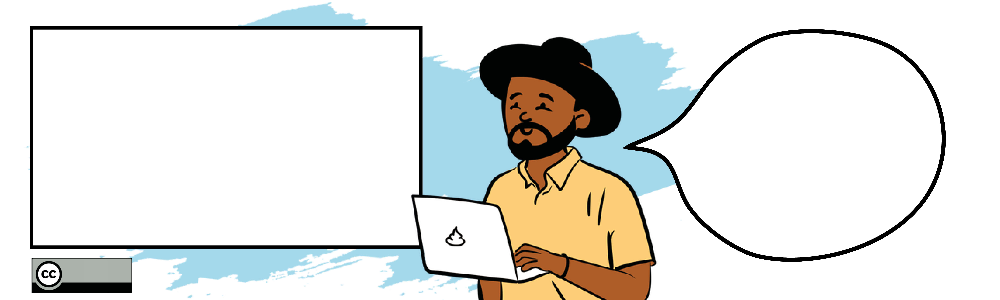

<!--
author:   Your Name

email:    your@mail.org

icon:     img/icon.png

version:  0.0.1

language: de

narrator: US English Female

comment:  Try to write a short comment about
          your course, multiline is also okay.

link:     style.css

script:   https://cdnjs.cloudflare.com/ajax/libs/PapaParse/5.3.1/papaparse.min.js

@onload

const baseURL = (new URL("img", window.location.search.substr(1))).href

window["fish"] = {
  "body.typical": null,
  "body.flattened": null,
  "body.long": null,

  "mouth.inferior": null,
  "mouth.superior": null,
  "mouth.elongated": null,
  "mouth.terminal": null,

  "barbel.one": null,
  "barbel.several": null,
  "barbel.absent": null,

  "sucking_disc.present": null,
  "sucking_disc.absent": null,

  "color.black": null,
  "color.blue": null,
  "color.brown": null,
  "color.green": null,
  "color.grey": null,
  "color.red": null,
  "color.silver": null,
  "color.white": null,
  "color.yellow": null,

  "pattern.circles": null,
  "pattern.dots": null,
  "pattern.irregular": null,
  "pattern.spots": null,
  "pattern.stripes": null,
  "pattern.uniform": null,

  "fin.dorsal.one": null,
  "fin.dorsal.two": null,
  "fin.dorsal.three": null,
  "fin.dorsal.with_adipose": null,
  "fin.dorsal.with_finlets": null,
  "fin.dorsal.with_spines": null,

  "fin.pelvic.pelvic": null,
  "fin.pelvic.pectoral": null,
  "fin.pelvic.jugular": null,
  "fin.pelvic.absent": null,

  "fin.caudal.forked": null,
  "fin.caudal.straight": null,
  "fin.caudal.rounded": null,
  "fin.caudal.pointed": null,
  "fin.caudal.not_symmetric": null,
}

window["button"] = function(title, active, image) {
  const color = active ? '#f0842c' : "black" 
  return `

    <h4>${title}</h4>
    
  
`
}

window.fish_filter = function() {
  if (window.fish) {
    let items = []
    for (const [item, selected] of Object.entries(window.fish)) {
      if (selected) {
        items.push(item)
      }
    }

    let result_often = []
    let result_seldom = []

    for (const fish of window.fish_db) {      
      let rslt = true

      for (const item of items) {
        if (!fish[item]) {
          rslt = false
          break
        }
      }

      if (rslt) {
        console.log("ssssssssssssssssss", fish["amount.often"])
        if (fish["amount.often"]) {
          result_often.push(fish.name)
        } else {
          result_seldom.push(fish.name)
        }
      }
    }

    const div = document.getElementById("results")

    if (div) {
      let list = ""

      if (result_often.length > 0) {
        list += " <h3>Häufig und regelmäßig in der Ostsee</h3>"
      }

      for(const fish of result_often) {
        let url = fish.toLocaleLowerCase().replace(/ /g, "-")
        let url_ = 
        list += `<a style="display: inline-flex; padding: 1rem; margin: 1rem; border: 1px solid black" href="#${url}"><h4>${fish}</h4></a>`
      }

      if (result_seldom.length > 0) {
        list += "<h3>Selten und als Irrgast in der Ostsee</h3>"
      }

      for(const fish of result_seldom) {
        let url = fish.toLocaleLowerCase().replace(/ /g, "-")
        let url_ = 
        list += `<a style="display: inline-flex; padding: 1rem; margin: 1rem; border: 1px solid black" href="#${url}"><h4>${fish}</h4></a>`
      }

      div.innerHTML = list
    }
  }
}

const CSV=`name,color.green,fin.dorsal.two,fin.dorsal.with_adipose,fin.caudal.forked,color.red,amount.often,pattern.uniform,color.brown,fin.dorsal.one,fin.pelvic.jugular,barbel.absent,fin.dorsal.with_spines,body.typical,color.silver,mouth.superior,body.flattened,pattern.dots,fin.dorsal.three,pattern.irregular,sucking_disc.present,fin.pelvic.pelvic,color.black,fin.caudal.pointed,fin.caudal.not_symetric,fin.pelvic.pectoral,color.grey,mouth.terminal,fin.caudal.straight,color.blue,pattern.spots,sucking_disc.absent,body.long,barbel.one,fin.pelvic.absent,fin.caudal.rounded,pattern.circles,color.yellow,mouth.elongated,pattern.stripes,fin.dorsal.with_finlets,mouth.inferior,barbel.several,color.white
Aal,,,,,,true,true,true,true,,true,,,true,true,,,,,,,true,true,,,true,true,,,,true,true,,true,,,true,,,,,,true
Aalmutter,,,,,,true,,true,true,true,true,,,,,,,,,,,true,true,,,true,true,,,true,true,true,,,,,true,,true,,,,
Adlerfisch,,true,,,,false,true,true,true,,true,,true,true,,,,,,,,true,,,true,true,true,true,,,true,,,,,,,,,,,,
Ährenfisch,,true,,true,,true,true,,,,true,,true,true,true,,,,,,,,,,true,,,,true,,true,,,,,,,,,,,,
Aland,,,,true,true,true,true,true,true,,true,,true,true,,,,,,,true,,,,,true,true,,,,true,,,,,,,,,,,,
Atlantischer Stör,,,,,,false,true,true,true,,,,true,,,,,,,,true,,,true,,true,,,,,true,true,,,,,,,,,true,true,true
Bachschmerle,,,,,,true,,true,true,,,,true,,,,,,true,,true,true,,,,true,,true,,true,true,true,,,,,,,,,true,true,true
Barbe,,,,true,true,false,true,true,true,,,,true,,,,,,,,true,,,,,true,,,,,true,,,,,,true,,,,true,true,true
Bitterling,true,,,true,true,false,true,true,true,,true,,true,true,,,,,,,true,,,,,true,true,,true,,true,,,,,,true,,true,,true,,
Blauer Wittling,,,,true,,true,true,,,true,true,,true,true,true,,,true,,,,,,,,,true,true,true,,true,,,,,,,,,,,,true
Blauhai,,true,,,,false,true,,,,true,,true,,,,,,,,true,,,true,,true,,,true,,true,,,,,,,,,,true,,true
Brachsen,,,,true,,true,true,,true,,true,,true,true,,,,,,,true,,,,,true,true,,,,true,,,,,,,,,,true,,
Brachsenmakrele,,,,true,,false,true,,true,,true,,true,true,true,,,,,,,true,,,true,true,true,,,,true,,,,,,,,,,,,
Brandbrassen,,,,true,,false,true,true,true,,true,,true,true,,,,,,,,,,,true,true,true,,,,true,,,,,,true,,true,,,,
Buckellachs,,,true,true,true,false,,true,,,true,,true,true,,,true,,,,true,,,,,true,true,true,true,,true,,,,,,,,,,,,
Butterfisch,,,,,,true,,true,true,true,true,,,,,,,,,,,true,,,,true,true,,,true,true,true,,,true,true,,,,,,,
Chagrinrochen,,true,,,,false,true,true,,,true,,,,,true,true,,,,true,true,true,,true,true,,,,true,true,,,,,true,,,,,true,,true
Conger,,,,,,false,true,,true,,true,,,true,,,,,,,,,true,,,true,,,,,true,true,,true,,,,,,,true,,true
Dicklippige Meeräsche,,true,,true,,true,true,,,,true,,true,true,,,,,,,,,,,true,true,true,,true,,true,,,,,,,,true,,,,
Döbel,,,,true,true,false,,true,true,,true,,true,true,,,,,,,true,,,,,true,true,,,,true,,,,,,true,,,,,,
Doggerscharbe,,,,,,false,true,true,true,true,true,,,,,true,true,,true,,,,,,,true,true,,,,true,,,,true,,,,,,,,true
Dorsch,true,,,,,true,,true,,true,,,true,,,,true,true,true,,,,,,,,,true,,,true,,true,,,,true,,,,true,,true
Dreistachliger Stichling,true,,,,true,true,true,true,,,true,true,true,true,,,,,,,true,,,,true,true,true,true,,,true,,,,,,,,,,,,true
Dünnlippige Meeräsche,,true,,true,,true,true,,,,true,,true,true,,,,,,,,,,,true,true,true,,true,,true,,,,,,,,,,,,
Einfarbiger Pelamide,,true,,true,,false,true,,,,true,,true,true,,,,,,,,,,,true,true,true,,true,,true,,,,,,,,,true,,,true
Finte,,,,true,,false,true,,true,,true,,true,true,,,,,,,true,true,,,,true,true,,true,true,true,,,,,,,,,,,,
Fleckengrundel,,true,,,true,true,,true,,,true,,true,,true,,true,,true,true,,true,,,true,true,true,,true,true,,,,,true,,true,,true,,,,true
Fleckhai,,true,,,,false,,true,,,true,,true,,,,,,true,,true,true,,true,,,,,,true,true,,,,,,,,,,true,,true
Flunder,,,,,true,true,true,true,true,true,true,,,,,true,,,true,,,true,,,,true,true,,,true,true,,,,true,,,,,,,,true
Flussbarsch,,true,,true,true,true,,true,,,true,,true,,,,,,,,,true,,,true,true,true,,,,true,,,,,,true,,true,,,,
Flussneunauge,,true,,,,true,true,,,,true,,,true,,,,,true,,,true,true,,,true,,,,,true,true,,true,,,,,,,true,,true
Franzosendorsch,,,,,,false,true,true,,true,,,true,true,,,,true,,,,true,,,,true,,true,,true,true,,true,,,,,,true,,true,,
Froschdorsch,,true,,,,true,true,true,,true,,,true,,,,,,,,,true,,,,,,,,,true,,true,,true,,,,,,true,,
Fuchshai,,true,,,,false,true,,,,true,,true,,,,,,,,true,,,true,,true,,,true,,true,,,,,,,,,,true,,true
Gabeldorsch,,true,,,,false,true,true,,true,,,true,,,,,,,,,,,,,true,,true,,,true,,true,,,,,,,,true,,true
Gabelmakrele,,,,true,,false,true,,,,true,true,true,true,,,,,,,,true,,,true,true,true,,,true,true,,,,,,,,,,,,true
Gefleckter Lippfisch,true,,,,true,true,,true,true,,true,,true,,,,true,,true,,,true,,,true,,true,true,,true,true,,,,true,,true,,true,,,,true
Gemeiner Dornhai,,true,,,,false,true,true,,,true,,true,,,,true,,,,true,,,true,,true,,,,,true,,,,,,,,,,true,,true
Gemeiner Seeteufel,,true,,,,false,true,true,,true,true,true,,,true,true,,,true,,,,,,,true,,true,,,true,,,,true,,,,,,,,true
Gemeine Seezunge,,,,,,true,true,true,true,true,true,,,,,true,true,,true,,,true,,,,true,,,,true,true,,,,true,,,,,,true,true,true
Gestreifeter Leierfisch,,true,,,,false,,true,,true,true,,true,,,,,,true,,,,,,,,true,true,true,true,true,,,,true,,true,,true,,true,,true
Gestreifter Seewolf,,,,,,false,,,true,,true,,true,,,,,,,,,true,,,,true,true,true,true,,true,true,,true,true,,,,true,,,,
Gewöhnlicher Stechrochen,,,,,,false,true,true,,,true,true,,,,true,,,,,true,true,true,,true,true,,,,,true,,,,,,,,,,true,,true
Giebel,,,,true,,false,true,true,true,,true,,true,true,,,,,,,true,,,,,true,true,,true,,true,,,,,,true,,,,,,
Glasgrundel,,true,,,,true,true,,,,true,,true,,true,,true,,,true,,true,,,true,true,true,true,,,,,,,true,,,,,,,,true
Glattbutt,,,,,,true,,true,true,true,true,,,,,true,true,,true,,,true,,,,true,true,,,true,true,,,,true,,true,,,,,,
Glattrochen,,true,,,,false,,true,,,true,,,,,true,true,,true,,true,true,true,,,true,,,,true,true,,,,,true,true,,,,true,,true
Goldmaid,true,,,,true,true,,true,true,,true,,true,,,,,,true,,,true,,,true,,true,true,,true,true,,,,true,,true,,true,,,,
Goldmeeräsche,,true,,true,,false,true,,,,true,,true,true,,,,,,,,,,,true,true,true,,,,true,,,,,,true,,,,,,
Graskarpfen,,,,true,,false,true,true,true,,true,,true,,,,,,,,true,,,,,true,true,,,,true,,,,,,,,,,,,true
Grasnadel,true,,,,,true,true,true,true,,true,,,,true,,,,,,,,,,,,,,,true,true,true,,true,true,,true,true,true,,,,
Grauer Knurrhahn,,true,,true,true,true,true,true,,,true,,true,true,,,,,true,,true,true,,,true,true,,true,,,true,,,,,,,,,,true,,true
Grauhai,,,,,,false,true,true,true,,true,,true,,,,,,,,true,,,true,,true,,,,,true,,,,,,,,,,true,,true
Grosser Sandaal,,,,true,,true,true,,true,,true,,,true,true,,,,,,,true,,,,true,true,,true,true,true,true,,true,,,,,,,,,
Großer Scheibenbauch,,,,,,true,true,true,true,,true,,true,,,,,,true,true,,,,,true,true,,,,true,,,,,true,,true,,true,,true,,true
Grosse Schlangennadel,,,,,true,false,,true,true,,true,,,true,true,,,,true,,,,true,,,true,,,true,true,true,true,,true,true,,true,true,true,,,,
Grosse Seenadel,true,,,,true,true,true,true,true,,true,,,,true,,,,,,,,,,,true,,,,true,true,true,,true,true,,true,true,true,,,,
Gründling,,,,true,,false,,true,true,,,,true,,,,true,,,,true,true,,,,,,,true,true,true,,,,,,true,,,,true,true,
Güster,,,,true,true,true,true,,true,,true,,true,true,,,,,,,true,,,,,true,true,,,,true,,,,,,,,,,true,,
Haarbutt,,,,,,true,,true,true,true,true,,,,,true,true,,true,,,true,,,,true,true,,,true,true,,,,true,true,,,,,,,true
Hasel,,,,true,true,false,true,true,true,,true,,true,true,,,,,,,true,,,,,true,,,,,true,,,,,,,,,,true,,
Hecht,true,,,true,,true,,true,true,,true,,true,,,,true,,true,,true,,,,,,true,,,true,true,true,,,,,true,true,true,,,,true
Heilbutt,,,,,,false,true,true,true,true,true,,,,,true,,,,,,,,,,true,true,true,,,true,,,,,,,,,,,,true
Hering,,,,true,,true,true,,true,,true,,true,true,true,,,,,,true,true,,,,,,,true,,true,,,,,,,,,,,,
Heringshai,,true,,,,false,true,,,,true,,true,,,,,,,,true,true,,true,,true,,,true,,true,,,,,,,,,,true,,true
Heringskönig,,true,,,,false,,true,true,,true,,true,,true,,,,true,,,true,,,true,true,,,,true,true,,,,true,true,true,,,,,,
Hornhecht,true,,,true,,true,true,,true,,true,,,true,,,,,,,true,,,,,true,,,true,,true,true,,,,,,true,,,,,
Hundszunge,,,,,,false,true,true,true,true,true,,,,,true,true,,true,,,,,,,true,true,,,,true,,,,true,,,,,,,,true
Karausche,,,,true,,true,true,true,true,,true,,true,true,,,,,,,true,,,,,true,true,true,,true,true,,,,,,true,,,,,,
Karpfen,true,,,true,,false,true,true,true,,,,true,,,,,,,,true,,,,,true,true,,,,true,,,,,,true,,,,,true,
Kaulbarsch,,,,true,,true,,true,true,,true,,true,,,,true,,,,,true,,,true,,true,,,true,true,,,,,,true,,,,,,true
Kleine Maräne,,,true,true,,true,true,,,,true,,true,true,true,,,,,,true,,,,,,,,,,true,,,,,,,,,,,,
Kleiner Sandaal,true,,,true,,false,true,,true,,true,,,true,true,,,,,,,,,,,true,true,,true,,true,true,,true,,,,,,,,,
Kleiner Scheibenbauch,,,,,true,false,true,true,true,,true,,true,,,,,,true,true,,,,,true,true,true,,,true,,,,,true,,true,,true,,,,true
Kleine Schlangennadel,true,,,,true,true,true,true,true,,true,,,,true,,,,true,,,true,true,,,true,,,true,,true,true,,true,,,true,true,true,,,,
Kleine Seenadel,true,,,,,true,true,true,true,,true,,,,true,,,,,,,,,,,true,,,,true,true,true,,true,true,,true,true,true,,,,
Kleingefleckter Katzenhai,,true,,,,true,,true,,,,,true,,,,true,,,,true,true,,true,,,,,,true,,true,,,,,,,,,true,,true
Kliesche,,,,,true,true,true,true,true,true,true,,,,,true,true,,,,,,,,,true,true,,,true,true,,,,true,,,,,,,,true
Klippenbarsch,true,,,,true,true,true,true,true,,true,,true,,,,,,,,,,,,true,true,true,true,,true,true,,,,true,,,,,,,,true
Köhler,true,,,true,,true,true,true,,true,true,,true,,true,,,true,,,,,,,,true,,,true,,true,,true,,,,,,,,,,
Lachs,,,true,true,,true,,true,,,true,,true,true,,,true,,,,true,true,,,,true,true,true,true,,true,,,,,,true,,true,,,,
Lammzunge,,,,,,false,,true,true,true,true,,,,,true,,,true,,,,,,,true,true,,,true,true,,,,true,,,,,,,,true
Langflossen Brachsenmakrele,,,,true,,false,true,,true,,true,,true,true,true,,,,,,,true,,,true,true,true,,,,true,,,,,,,,,,,,
Leng,,true,,,,false,true,true,,true,,,true,,,,,,,,,,,,,true,true,,,,true,true,true,,true,,true,,,,,,true
Maifisch,,,,true,,false,true,,true,,true,,true,true,,,,,,,true,true,,,,true,true,,true,true,true,,,,,,,,,,,,
Makrele,,,,true,,true,,,,,true,,true,true,,,,,,,,true,,,true,true,true,,true,,true,,,,,,,,true,true,,,true
Makrelenhecht,true,,,true,,false,true,,,,true,,,true,,,,,,,true,,,,,true,,,,,true,true,,,,,,true,,true,,,true
Marmorkarpfen,,,,true,,false,true,true,true,,true,,true,true,true,,,,true,,true,true,,,,true,,,,,true,,,,,,,,,,,,true
Meerengel,,true,,true,,false,,true,,,true,,,,,true,,,true,,true,true,,true,,true,true,,,,true,,,,,,,,,,,,true
Meerforelle,,,true,true,true,true,,true,,,true,,true,true,,,true,,,,true,true,,,,true,true,true,true,,true,,,,,,true,,,,,,
Meerneunauge,,true,,,,true,,,,,true,,,,,,,,true,,,true,true,,,true,,,true,true,true,true,,true,,,true,,,,true,,true
Moderlieschen,,,,true,,true,true,,true,,true,,true,true,true,,,,,,true,,,,,true,,,true,,true,,,,,,true,,,,,,
Mondfisch,,,,,,false,true,true,true,,true,,true,true,,,,,,,,,,,,true,true,,,true,true,,,true,true,,,,,,,,true

`

Papa.parse(CSV, {
  quotes: false,
  header: true,
  dynamicTyping: true,
  complete: function(data){
    window.fish_db = data.data

    setTimeout(window.filter_fish, 2000)
  }
})

@end

@button

@end

-->

# Netzwerk ORCA.nrw 

Herzlich willkommen auf dieser Seite, die sich im Moment noch im Dummy-Status befindet.
Wir starten hier mit einem schönen Einleitungstext, in dem wir uns kurz vorstellen, bzw. Jamal, der schon total überzeugt ist von OER, ebenso wie seine 3rd-Space-Mitarbeitenden.
Deswegen freuen wir uns alle, dass es diese Sammlung gibt, die das ORCA-Netzwerk zusammengetragen hat. 

Ganz schön viel! Daher gibt es hier eine Filtermöglichkeit:

---

<!--
persistent: true
-->

 OER-Material-Sieb 

__Level__

@[button(body.typical,Einsteiger)](Bilder/L-Einsteiger.png)
@[button(body.long,Praktiker)](Bilder/L-Praktiker.png)
@[button(body.flattened,Experte)](Bilder/L-Experte.png)

---

__Praxiskategorie__

@[button(mouth.terminal,OER finden)](Bilder/B-1.png)
@[button(mouth.superior,OER herstellen)](Bilder/B-2.png)
@[button(mouth.inferior,Mit OER lernen)](Bilder/B-3.png)
@[button(mouth.elongated,Mit OER lehren)](Bilder/B-4.png)
@[button(mouth.elongated,OER einführen)](Bilder/B-5.png)
@[button(mouth.superior,OER managen)](Bilder/B-6.png)
@[button(mouth.superior,über OER forschen)](Bilder/B-7.png)

---

__Medienart__

@[button(mouth.terminal,Audio)](Bilder/M-1.png)
@[button(mouth.superior,Video)](Bilder/M2.png)
@[button(mouth.inferior,Text)](Bilder/M-3.png)
@[button(mouth.inferior,Text)](Bilder/M-3.png)
@[button(mouth.inferior,Text)](Bilder/M-3.png)
@[button(mouth.elongated,H5P)](Bilder/M-4.png)
@[button(mouth.elongated,Kurs)](Bilder/M-5.png)

---

        

*das ist erstmal ein Platzhalter. Ich würde  den wie unten auf 1200px verbreitern, wenn die Darstellung konstistent gut ist, die Medientypen in der Farbigkeit der Hintergründe weiter unten spezifisch aufgreifen und eine kleine Hommage an OER und Oder ORCA einbauen. Wobei, letzters könnte ja ins Impressum durch einen "gefördert von" Abbinder.*

Für Inspiration einfach entlang der Seitenleiste durchklicken.

---

## OER finden

Einleitungstext

Material-Darstellung 
Gallery? Mal ja, mal nein, woran liegts?
<!-- style="display: block; margin: auto; width: 60%;" -->

         

Accordion? Wie bekommt man da noch Text drunter?

---

Literatursammlung

Wissenschaftliche Veröffentlichung 
Dr. Sina Nitzsche, Florian Rosenthal, Laura Schaffeld, Dr. Elisabeth Scherer, Dr. Magdalena Spaude, Dr. Tassja Weber: OER Tracks and the ORCA.nrw Network: Promoting OER in Higher Education. 13. Open Educational Research Conference, Association of Learning Technology mit dem Global OER Graduate Network. Online unter: https://www.youtube.com/supported_browsers?next_url=https%3A%2F%2Fwww.youtube.com%2Fwatch%3Fv%3DH5Zbo5Cyo_M 

Susanne Grimm, Alexander Kobusch, Gabi Reichardt, Dr. Magdalena Spaude, Markus Deimann. 2021: zugehOERt 080: Im Gespräch mit Alexander Kobusch, Gabi Reichardt, Magdalena Spaude und Markus Deimann. Online unter: https://open-educational-resources.de/zugehoert-080-orca-nrw/

OER-Supportmaterial
Dr. Sina Nitzsche: Lehr- und Lernmaterialien frei Haus.2021: Open Educational Resources. Online unter: https://heyzine.com/flip-book/11b57ddf01.html#page/168

## OER herstellen

---

## Mit OER lernen

---

## Mit OER lehren

---

## OER einführen
abc

---

## OER managen
abc

---

## OER herstellen
abc 

---

## über OER forschen
abc

---

## Materialien (alphabetisch?)

<article class="main-info">
>
<!--
***>> LINK ZUM LIA
https://liascript.github.io/course/?https://api.allorigins.win/raw?url=https://raw.githubusercontent.com/Steffi82/ORCA-Netzwerk-NRW/main/Outputsammlung.md#1  
-->
  
<!-- BLANKO
---
## `Medientyp FEHLT` | TITEL

  <!-- Bezeichnung für das echte: (MEDIENTYP_Name-wie-Titel-sinnvoll-verkuerzt_CC-Lizenz des Materials) --> <!-- 
Hier steht ein kurzer **Beschreibungstext**, der **Mehrwerte** und oder **Nutzungsszenarien** sowie **USP** beschreibt..

***| `Medienformat:`*** FORMAT z.B. *PDF* ***| `erstellt/bearbeitbar mit:`*** *unbekannt*  
***| `Niveaustufe(n):`*** *Einsteiger (Starter) / Praktiker / Experte  
***| `Praxiskategorie(n)`*** *1OER finden/2OER herstellen/3Mit OER lernen/4Mit OER lehren/5OER einführen/6OER managen/7Über OER forschen* 

> ***Zitationsvorschlag nach TULLU-Regel:***   
> *Titel; von *Urheber*; [CC LIZENZ](https://creativecommons.org/licenses/); Link führt zu *[Ursprungsort](https://)*

***| `didaktische Metadaten:`*** *tbd* 
--- 
-->

<!-- TULLU-Regel: Titel, Urheber, Lizenz, Link, Ursprungsort -->

<!--   
"OERInfo - Contentbuffet: Praxiskategorie:
1. OER finden
2. OER herstellen
3. Mit OER lernen
4. Mit OER lehren
5. OER einführen
6. OER managen
7. Über OER forschen"
--> 
 
 <!-- (MEDIENTYP_Name_CC) --> 
-->

---
<!--01--> 
## `Postkarte` | CC-Lizenzhinweise erstellen – die TULLUBA‐Regel

 <!-- (Postkarte_CC‐Lizenzhinweise–TULLUBA‐Regel_CCBY40) -->
Die Postkarte kann als **Auslagematerial** auf **Veranstaltungen** oder **Schulungen** verwendet werden. Das Motiv kann darüber hinaus auch digital, z.B. in **Präsentationen**, genutzt werden.

***| `Medienformat:`*** *PDF* ***| `erstellt/bearbeitbar mit:`*** *unbekannt*  
***| `Niveaustufe(n):`*** *Einsteiger (Starter)* 
***| `Praxiskategorie(n)`*** *OER herstellen; Mit OER lernen; Mit OER lehren; OER einführen* 

> ***Zitationsvorschlag nach TULLU-Regel:***   
> *CC‐Lizenzhinweise erstellen – die TULLUBA‐Regel; von AG Werbung Netzwerk Landesportal ORCA.nrw; [CC BY 4.0](https://creativecommons.org/licenses/by/4.0/); Link führt zu [ORCA.nrw (intern)](https://community.orca.nrw/content/perma?id=144367)*

***| `didaktische Metadaten:`*** *Creative Commons; Lizenz; Lizenzhinweis; Urheberrecht*

---
<!--02-->
## `Textdokument` | Checkliste Open Educational Resources erstellen (v2.0)

  <!-- (Textdokument_Checkliste-OER-erstellen-v2-0_CCBY40) -->
Der Leitfaden gibt eine **Orientierung** zu den Fragen nach **rechtlichen Maßgaben** sowie **Qualitätsmerkmalen zur Entwicklung und Beurteilung** von  OER-Materialien.

***| `Medienformat:`*** *PDF; Textdokument* ***| `erstellt/bearbeitbar mit:`*** *MS Word*  
***| `Niveaustufe(n):`*** *Einsteiger (Starter); Praktiker* 
***| `Praxiskategorie(n)`*** *OER herstellen* 

> ***Zitationsvorschlag nach TULLU-Regel:***   
> *Checkliste Open Educational Resources erstellen (v2.0); von Kobusch,Alexander; Halm, Linda; [CC BY 4.0](https://creativecommons.org/licenses/by/4.0/); Link führt zu [Twillo](https://www.twillo.de/edu-sharing/components/render/6c1f1da2-7ff6-4dd6-b87b-0404b980cc50)*

***| `didaktische Metadaten:`*** *OER; Urheberrecht; Barrierefreiheit; Persönlichkeitsrecht; Produktion, Qualität*

---
<!--03-->
## `Lernspiel` | Learning Snacks: "ORCA.nrw: A University Network for OER"

 <!--(Selbstlernkurs_LearningSnack_ORCAnrw-UniversityNetwork-for-OER_CCBYSA40) -->
The example is based on a German network. You can find out **how the network works** and how it **advises on OER** together with the teacher Dr Jamal Groenstein, who gets to know the network as a protagonist. 

***| `Medienformat:`*** *interaktive Web-Anwendung* ***| `erstellt/bearbeitbar mit:`*** *Webanwendung [LearningSnacks](https://www.learningsnacks.de)*  
***| `Niveaustufe(n):`*** *Einsteiger (Starter); Praktiker*  
***| `Praxiskategorie(n)`*** *OER finden; OER herstellen; mit OER lernen; mit OER lehren; OER einführen; OER managen* 

> ***Zitationsvorschlag nach TULLU-Regel:***   
> *Learning Snacks: "ORCA.nrw: A University Network for OER"; von *Eube, Cornelia; Kobusch, Alexander; Niemann, Andrea; Nitzsche, Sina; Scherer, Elisabeth; Spaude, Magdalena*; [CC BY‐SA 4.0](https://creativecommons.org/licenses/by‐sa/4.0/); Link führt zu *[Learning Snacks](https://www.learningsnacks.de/share/218584/)*

***| `didaktische Metadaten:`*** *OER; OER consultation; OER network; University; Higher Education*

---
<!--04-->
## `Selbstlernkurs` | Lehre und Lernen öffnen: Open Educational Resources (OER) ‐ OpenRUB
 <!--(Selbstlernkurs_Lehre-und-Lernen-oeffnen-OER-OpenRUB) -->
Der erste der drei Lernabschnitte des Kurses behandelt den Einstieg in das Thema **Open Educational Resources**, OER werden definiert und erläutert,  wie sie genutzt und selbst erstellt werden können. Der Bereich **Creative Commons-Lizenzen** erklärt das Konzept und zeigt, CC-Lizenzen selbst (weiter-)genutzt werden können. Der letzte Teil, **Lehre und Lernen öffnen** gibt Empfehlungen, wie eigenes Lehren oder Lernen an der Ruhr-Universität Bochum geöffnet werden kann.

Zusätzlich werden ein Glossar mit den wichtigsten Begriffen rund um das Thema OER und ein Quiz angeboten.

***| `Medienformat:`*** *Selbstlernkurs* ***| `erstellt/bearbeitbar mit:`*** *Moodle*  
***| `Niveaustufe(n):`*** *Einsteiger (Starter)*  
***| `Praxiskategorie(n)`*** *OER finden; OER herstellen; Mit OER lernen; Mit OER lehren; OER einführen*  

> ***Zitationsvorschlag nach TULLU-Regel:***   
> *Lehre und Lernen öffnen: Open Educational Resources (OER) ‐ OpenRUB; von Fuchs, Michael; Braungardt, Kathrin; Görlich, Sarah; [CC BY‐SA 4.0](https://creativecommons.org/licenses/by‐sa/4.0/); Link führt zum [OERSI](https://oersi.org/resources/aHR0cHM6Ly9vcGVuLnJ1aHItdW5pLWJvY2h1bS5kZS9sZXJuYW5nZWJvdC9sZWhyZS11bmQtbGVybmVuLW9lZmZuZW4tb3Blbi1lZHVjYXRpb25hbC1yZXNvdXJjZXM=)*

***| `didaktische Metadaten:`*** *Einführung; Lehre; Online-Lehre; OER; open; Lernen; Kursöffnung; Creative Commons; CC; Moodle-Showroom*

---
<!--05-->
## `Textdokument` | Trainingskonzept: Feedback zu OER geben mit dem OER‐Feedbackrad

  <!-- (Textdokument_Trainingskonzept-Feedbackrad-OER_CCBY40) --> 
Mit dem OER-Feedbackrad trainieren **Lehrende**, sich gegenseitig zu einer **selbst erstellten OER** Feedback zu geben. Alternativ kann hiermit zu einer **gefundenen/bereitgestellten OER** Feedback gegeben werden..

***| `Medienformat:`*** *PDF; Textdokument* ***| `erstellt/bearbeitbar mit:`*** *MS Word*  
***| `Niveaustufe(n):`*** *Einsteiger (Starter); Praktiker*  
***| `Praxiskategorie(n)`*** *OER herstellen; OER einführen*  

> ***Zitationsvorschlag nach TULLU-Regel:***   
> *Trainingskonzept: Feedback zu OER geben mit dem OER‐Feedbackrad; von *Geurden, Bianca; [CC BY 4.0](https://creativecommons.org/licenses/by/4.0/); Link führt zu [Twillo](https://www.twillo.de/edusharing/components/render/fd2d1f38‐3a09‐4230‐9e3c‐cdcb4c072f6b)*

***| `didaktische Metadaten:`*** *Feedbackkultur; Feedback; OER-Feedbackrad; Open Educational Culture; OEC; OER; Trainingskonzept*

---
<!--06-->
## `Textdokument` | Aufzeichnung von Online‐Konferenzbeiträgen als OER: Ein Praxisleitfaden

  <!-- (Textdokument_Praxisleitfaden-Aufzeichnung-Online‐Konferenzbeitraege_OER_CC) --> 
Der **Praxisleitfaden** gibt **Vortragenden** wertvolle Tipps und Tricks für die **Vorbereitung, Durchführung** und **Nachbereitung** einer digitalen Veranstaltung, die aufgezeichnet werden und anschließend als OER veröffentlicht werden kann.

***| `Medienformat:`*** FORMAT z.B. *PDF* ***| `erstellt/bearbeitbar mit:`*** *unbekannt*  
***| `Niveaustufe(n):`*** *Einsteiger (Starter); Praktiker*  
***| `Praxiskategorie(n)`*** *OER herstellen; OER einführen; OER managen*  

> ***Zitationsvorschlag nach TULLU-Regel:***   
> *Aufzeichnung von Online‐Konferenzbeiträgen als OER: Ein Praxisleitfaden; von Geurden, Bianca; Görlich, Sarah; Hützen, Nicole; Jahn, Markus; Méndez Parente, Josefine; Nitzsche, Sina; [CC BY 4.0](https://creativecommons.org/licenses/by/4.0/); Link führt zu [Twillo](https://www.twillo.de/edusharing/components/render/d7d698e4‐d9e9‐47fb‐87e4‐86283206c982)*

***| `didaktische Metadaten:`*** *Online-Veranstaltung; Hochschuldidaktik; Leitfaden; Videoproduktion; OER-Fachtag; Konferenzorganisation; Dokumentation; Digitalisierung*

---
<!--07-->
<!-- 
## `Medientyp FEHLT` | Handlungsempfehlungen zu einer OEC an Hochschulen

  <!-- (MEDIENTYP_Name_CC) 
Hier steht ein kurzer **Beschreibungstext**, der **Mehrwerte** und oder **Nutzungsszenarien** sowie **USP** beschreibt..

***| `Medienformat:`*** FORMAT z.B. *PDF* ***| `erstellt/bearbeitbar mit:`*** *unbekannt*  
***| `Niveaustufe(n):`*** *Einsteiger (Starter) / Praktiker / Experte  
***| `Praxiskategorie(n)`*** *1OER finden/2OER herstellen/3Mit OER lernen/4Mit OER lehren/5OER einführen/6OER managen/7Über OER forschen* 

> ***Zitationsvorschlag nach TULLU-Regel:***   
> *Handlungsempfehlungen zu einer OEC an Hochschulen; von Geurden, Bianca; Jahn, Markus; Schütgen, Robin; Kober, Sabine; Schotemeier, Sarah; Reichardt, Gabi; Heckmann, Henrike; Hörmann, Irina; Méndez Parente, Josefine [CC BY 4.0](https://creativecommons.org/licenses/by/4.0/); Link führt zu *[Twillo](https://www.twillo.de/edu‐sharing/components/collections?id=37db10ff‐98c1‐45c0‐960a‐34485dfab123)*

***| `didaktische Metadaten:`*** *tbd*

-->

---
<!--08-->
## `Nachschlagewerk` | OER‐Glossar

  <!-- (Nachschlagewerk_OER-Glossar_CCBY40) --> 
Dieses Glossar erläutert **52 zentrale Begriffe** rund um das Thema Open Educational Resources (OER). Stand: August 2023 

***| `Medienformat:`*** *Selbstlernkurs* ***| `erstellt/bearbeitbar mit:`*** *ILIAS; Moodle; HTML*  
***| `Niveaustufe(n):`*** *Einsteiger (Starter); Praktiker; Experte  
***| `Praxiskategorie(n)`*** *OER finden; OER herstellen; Mit OER lernen; Mit OER lehren*  

> ***Zitationsvorschlag nach TULLU-Regel:***   
> *OER‐Glossar; von Gödecke, Svenja; Halm, Linda; Homp, Frank; Kobusch, Alexander; Schaffeld, Laura; Spaude, Magdalena; Weber, Tassja; [CC BY 4.0](https://creativecommons.org/licenses/by/4.0/); Link führt zum [ILIAS der Uni zu Köln](https://www.edulabs.uni‐koeln.de/goto.php?target=crs_2218&client_id=iliasedulabs)*

***| `didaktische Metadaten:`*** *Urheberrecht; Werk; Barrierefreiheit; Zitat; Untertitel; Creative Commons; Lizenz; CC; Lehre, Repositorium*

---
<!--09-->
## `Video` | OER Lifecycle

  <!-- (Video_OER-Lifecycle_CCBY40) --> 
Hier steht ein kurzer **Beschreibungstext**, der **Mehrwerte** und oder **Nutzungsszenarien** sowie **USP** beschreibt..

***| `Medienformat:`*** FORMAT z.B. *PDF* ***| `erstellt/bearbeitbar mit:`*** *unbekannt*  
***| `Niveaustufe(n):`*** *Einsteiger (Starter); Praktiker*  
***| `Praxiskategorie(n)`*** *OER finden; OER herstellen; Mit OER lernen; Mit OER lehren; OER einführen; OER managen* 

> ***Zitationsvorschlag nach TULLU-Regel:***   
> *OER Lifecycle; von Homp, Frank; Dobosz, Nicole; Dahlmanns, Michelle; [CC BY 4.0](https://creativecommons.org/licenses/by/4.0/); Link führt zu [TIB AV Portal](https://av.tib.eu/media/66288)*

***| `didaktische Metadaten:`*** *OER; Open Educational Resources; Lifecycle; Kreislauf*
---

<!--09a-->
## `Abbildung` | OER Lifecycle

  <!-- (Abbildung_OER-Lifecycle_CCBY40) --> 
Hier steht ein kurzer **Beschreibungstext**, der **Mehrwerte** und oder **Nutzungsszenarien** sowie **USP** beschreibt..

***| `Medienformat:`*** FORMAT z.B. *PDF* ***| `erstellt/bearbeitbar mit:`*** *unbekannt*  
***| `Niveaustufe(n):`*** *Einsteiger (Starter); Praktiker*  
***| `Praxiskategorie(n)`*** *OER finden; OER herstellen; Mit OER lernen; Mit OER lehren; OER einführen; OER managen* 

> ***Zitationsvorschlag nach TULLU-Regel:***   
> *OER Lifecycle; von Homp, Frank; Dobosz, Nicole; Dahlmanns, Michelle; [CC BY 4.0](https://creativecommons.org/licenses/by/4.0/); Link führt zu [TWILLO](https://www.twillo.de/edu-sharing/components/render/d9d90fe0-3b67-4809-afcc-fe5b96c11d56)*

***| `didaktische Metadaten:`*** *Lebenszyklus; Materialkreislauf; Nachhaltigkeit*
---

<!--10-->  
## `Webseite` | Das OER Policy Kit

  <!-- (Webseite_PolicyKit_CCBYSA40) --> 
Eine OER Policy schafft hohe **institutionelle Verbindlichkeit** für das Thema OER und kann öffnet damit viele Türen hin zu einer anerkannten und gelebten **offenen Bildung**. Das OER-Policy Kit versteht sich als **Leitfaden zum Policy-Prozess** an Hochschulen. I zu verstehen und umfasst **sieben Stationen**, die mit **zahlreichen weiteren Materialien** ergänzt werden.

***| `Medienformat:`*** FORMAT z.B. *PDF* ***| `erstellt/bearbeitbar mit:`*** *Markdown; HTML; Github*  
***| `Niveaustufe(n):`*** *Einsteiger (Starter); Praktiker; Experte*  
***| `Praxiskategorie(n)`*** *OER einführen*  

> ***Zitationsvorschlag nach TULLU-Regel:***   
> *Das OER Policy Kit; von Homp, Frank; Dreyer, Astrid; Hörmann, Irina; Legler, Stefanie; Czerwinski, Silvia; Loose, Yulia; [CC BY‐SA 4.0](https://creativecommons.org/licenses/by‐sa/4.0/); Link führt zum [OERSI](https://oersi.org/resources/aHR0cHM6Ly93d3cudHdpbGxvLmRlL2VkdS1zaGFyaW5nL2NvbXBvbmVudHMvcmVuZGVyL2M0NmYxZjc1LTM2MzItNDI5ZS05ZmVhLTA0YTlmMThjMDQwZQ==)*

***| `didaktische Metadaten:`*** *tbd*

---

### hier gehts dann weiter (aktuell Sammelkiste)
 
a) Placeholder with link to Youtube

b) AV-Portal player embedded

<iframe width="560" height="315" scrolling="no" src="//av.tib.eu/player/40456" frameborder="0" allowfullscreen="allowfullscreen"></iframe>

c) Youtube embedded

<iframe width="420" height="315"
src="https://www.youtube.com/embed/fbZOii_l7M4" allowfullscreen="allowfullscreen">
</iframe>

---

-->

# Impressum
This template for OER courses is released under MIT. The content of the document is subject to the respective license as indicated at the end of the generated files or in the metadata.yml.

<article>

### Haftung für Links

Unser Angebot enthält Links zu externen Webseiten Dritter, auf deren Inhalte wir keinen Einfluss haben.
Deshalb können wir für diese fremden Inhalte auch keine Gewähr übernehmen.
Für die Inhalte der verlinkten Seiten ist stets der jeweilige Anbieter oder Betreiber der Seiten verantwortlich.
Die verlinkten Seiten wurden zum Zeitpunkt der Verlinkung auf mögliche Rechtsverstöße überprüft.
Rechtswidrige Inhalte waren zum Zeitpunkt der Verlinkung nicht erkennbar.
Eine permanente inhaltliche Kontrolle der verlinkten Seiten ist jedoch ohne konkrete Anhaltspunkte einer Rechtsverletzung nicht zumutbar.
Bei Bekanntwerden von Rechtsverletzungen werden wir derartige Links umgehend entfernen.

### Urheberrecht

ERstmal unterliegt der Inhalt dem deutschen Urheberrecht.
Die Vervielfältigung, Bearbeitung, Verbreitung und jede Art der Verwertung außerhalb der Grenzen des Urheberrechtes bedürfen der schriftlichen Zustimmung des jeweiligen Autors bzw. Erstellers.
Downloads und Kopien dieser Seite sind nur für den privaten, nicht kommerziellen Gebrauch gestattet.
Soweit die Inhalte auf dieser Seite nicht vom Betreiber erstellt wurden, werden die Urheberrechte Dritter beachtet.
Insbesondere werden Inhalte Dritter als solche gekennzeichnet.Sollten Sie trotzdem auf eine Urheberrechtsverletzung aufmerksam werden, bitten wir um einen entsprechenden Hinweis.
Bei Bekanntwerden von Rechtsverletzungen werden wir derartige Inhalte umgehend entfernen.

</article>
