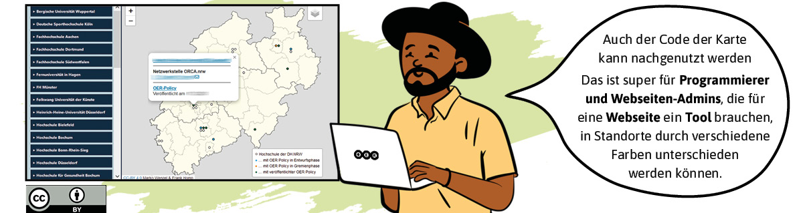
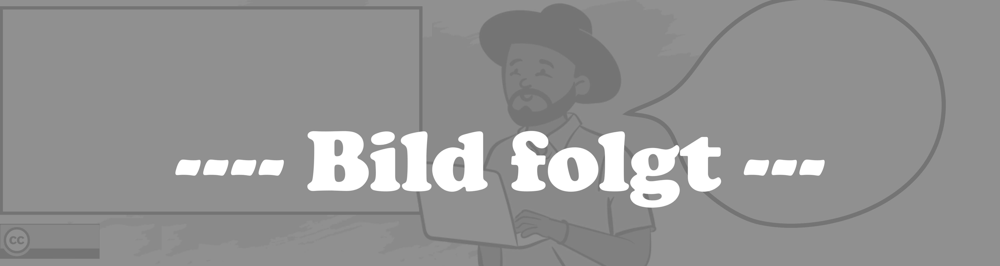

<!--
author:   Netzwerk ORCA.nrw
email:    your@mail.org

icon:     img/icon.png

version:  0.0.1

language: de

narrator: Deutsch Male

comment:  Material-Finder basierend auf dem Fischbestimmer von André Dietrich.

link:     style.css

@onload

const baseURL = (new URL("img", window.location.search.substr(1))).href

window["filter"] = {
  level: {
    beginner: null,
    praktiker: null,
    experte: null
  },

  praxiskategorie: {
    oer_finden: null,
    oer_herstellen: null,
    oer_lernen: null,
    oer_lehren: null,
    oer_einfuehren: null,
    oer_managen: null,
    oer_forschen: null
  },

  media: {
    audio: null,
    video: null,
    textdoc: null,
    selbstlernen: null,
    webseite: null,
    h5p: null,
    presentation: null,
    graphik: null
  }
}

@end

-->

# Material-Finder | Output Netzwerk ORCA.

Herzlich willkommen auf dieser Seite, die sich im Moment noch im Dummy-Status befindet.\
Wir starten hier mit einem schönen Einleitungstext, in dem wir uns kurz vorstellen, bzw. Jamal, der schon total überzeugt ist von OER, ebenso wie seine 3rd-Space-Mitarbeitenden.Deswegen freuen wir uns alle, dass es diese Sammlung gibt, die das Netzwerk ORCA.nrw zusammengetragen hat. Die Nutzunf funktionert über die Filterfunktion, die schon fast funktioniert - die Seitenleiste ist nach Medienarten kategorisiert, auch hier kann man sich inspirieren lassen. Wir freuen uns über Anregungen und Rückfragen, ebenso die Autor:innen der Materialien, und ermuntern ausdrücklich zur Nachnutzung der Materialien.

 Level 

__Level__

@[button(level,beginner,Einsteiger)](Bilder/L-Einsteiger-150x130px.png)
@[button(level,praktiker,Praktiker)](Bilder/L-Praktiker-150x75px.png)
@[button(level,experte,Experte)](Bilder/L-Experte-150x130px.png)

---

 Praxiskategorie 

__Praxiskategorie__

@[button(praxiskategorie,oer_finden,OER finden)](Bilder/OER-finden-100x75.png)
@[button(praxiskategorie,oer_herstellen,OER herstellen)](Bilder/OER-herstellen-100x75.png)
@[button(praxiskategorie,oer_lernen,Mit OER lernen)](Bilder/OER-lernen-100x75.png)
@[button(praxiskategorie,oer_lehren,Mit OER lehren)](Bilder/OER-lehren-100x75.png)
@[button(praxiskategorie,oer_einfuehren,OER einführen)](Bilder/OER-einfuehren-100x75.png)
@[button(praxiskategorie,oer_managen,OER managen)](Bilder/OER-managen-100x75.png)
@[button(praxiskategorie,oer_forschen,Über OER forschen)](Bilder/OER-erforschen-100x75.png)

---

__Medienart__

@[button(media,audio,Audio)](Bilder/M-1.png)
@[button(media,video,Video)](Bilder/M-Video-75x75.png)
@[button(media,textdoc,Textdokument)](Bilder/M-Textdoc-75x75.png)
@[button(media,selbstlernen,Selbstlernkurs)](Bilder/M-Selbstlernmaterialien-75x75.png)
@[button(media,webseite,Webseite)](Bilder/M-Webseiten-75x75.png)
@[button(media,h5p,H5P)](Bilder/M-H5P-75x75.png)
@[button(media,presentation,Praesentation)](Bilder/M-PraesiInterview-75x75.png)
@[button(media,presentation,Bilder/Grafik)](Bilder/M-Grafiken-75x75.png)

---

---

## Webseiten

Hier folgt noch ein Einleitungstext zur Kategorie.

---

### OER Policy‐Karte und Karte der Netzwerkstellen in NRW

`Webseite`
Die Karte zeigt **Hochschulstandorte** der DH.nrw und kennzeichnet solche, die eine **OER Policy veröffentlicht** haben.

`Medienformat` HTML  
`erstellt/bearbeitbar mit` Web-Editor  
`Niveaustufe(n)` Einsteiger (Starter)   
`Praxiskategorie(n)`OER managen  
`Metadaten` Karte; HTML; Farbschema; OER-Policy; DH.nrw  

>***Zitationsvorschlag nach TULLU-Regel:***
>*OER Policy‐Karte und Karte der Netzwerkstellen in NRW; von Wenzel, Marko; Homp, Frank; [CC BY 4.0](https://creativecommons.org/licenses/by/4.0); Link führt zu [Twillo](https://www.twillo.de/edu-sharing/components/render/1b355de9-849c-44ab-a219-42c325748eee)*

---

###  infOERmiert ‐ Der OER‐Blog vom Netzwerk Landesportal ORCA.nrw.  
Der `Blog` enthält **kurze informative Beiträge rund um OER**, die ursprünglich in der zugangsbeschränkten Community of Practice auf ORCA.nrw veröffentlicht wurden. **Der Blog bleibt offen und wird fortlaufend erweitert**.

`Medienformat:`*** *Ebook, PDF und HTML* ***`erstellt/bearbeitbar mit:`*** *Web-Editor*  
`Niveaustufe(n):`*** *Einsteiger (Starter)*  
***`Praxiskategorie(n)`*** *OER finden; OER herstellen; Mit OER lernen; Mit OER lehren; OER einführen; OER managen; Über OER forschen* >
***`Metadaten:`*** *OER; ORCA.nrw; Materialtipp; Praxiswerkstatt; Creative Commons; CC-Lizenz; Lizenzhinweis; OER-Policy; OER-Content*

> ***Zitationsvorschlag nach TULLU-Regel:***   
> *infOERmiert ‐ Der OER‐Blog vom Netzwerk Landesportal ORCA.nrw. Netzwerk Landesportal ORCA.nrw; von Urheber; [CC BY 4.0](https://creativecommons.org/licenses/by/4.0/); Link führt zum [OERSI](https://oersi.org/resources/aHR0cHM6Ly9saW5kYWhhbG0taHNiaS5naXRodWIuaW8vaW5mT0VSbWllcnQ=)*

---

## Selbstlern-Materialien

Hier folgt noch ein Einleitungstext zur Kategorie.

---

### OER‐Glossar   
Dieses `Nachschlagewerk` erläutert **52 zentrale Begriffe** rund um das Thema Open Educational Resources (OER).   
Stand: August 2023 

***`Medienformat:`*** *Selbstlernkurs* ***`erstellt/bearbeitbar mit:`*** *ILIAS; Moodle*  
***`Niveaustufe(n):`*** *Einsteiger (Starter); Praktiker; Experte*  
***`Praxiskategorie(n)`*** *n.a.*  
***`Metadaten:`*** *Urheberrecht; Werk; Barrierefreiheit; Zitat; Untertitel; Creative Commons; Lizenz; CC; Lehre, Repositorium*

> ***Zitationsvorschlag nach TULLU-Regel:***   
> *OER‐Glossar; von Gödecke, Svenja; Halm, Linda; Homp, Frank; Kobusch, Alexander; Schaffeld, Laura; Spaude, Magdalena; Weber, Tassja; [CC BY 4.0](https://creativecommons.org/licenses/by/4.0/); Link führt zum [ILIAS der Uni zu Köln](https://www.edulabs.uni‐koeln.de/goto.php?target=crs_2218&client_id=iliasedulabs)*
                                                                                                                                                                                               
                                                                                                                                                                                               
---

### OER‐Wissenspool
Der `Selbstlernkurs` vermittelt in fünf Kategorien **Basiswissen zu Open Educational Resources** mit NRW-spezifischen Empfehlungen. Zudem enthält er eine OER-Bibliothek und einen Bereich für **OER-Showcases**. Der Kurs kann auf die eigene Insitution angepasst werden. Es stehen **Installationsanleitungen** zur Einbindung ins eigene LMS zur Verfügung.

***`Medienformat:`*** Selbstlernkurs ***`erstellt/bearbeitbar mit:`*** *Moodle, Ilias; H5P*  
***`Niveaustufe(n):`*** *Einsteiger (Starter); Praktiker  
***`Praxiskategorie(n)`*** *OER finden: OER herstellen; mit OER lernen; mit OER lehren*  
***`Metadaten:`*** *OER erstellen; H5P; OER Basiswissen; OER-Supportmaterial*

> ***Zitationsvorschlag nach TULLU-Regel:***   
> *OER‐Wissenspool; von Nitzsche, Sina; Halm, Linda; [CC BY 4.0](https://creativecommons.org/licenses/by/4.0/); Link führt zu [Twillo](https://www.twillo.de/edu-sharing/components/render/2345cca5-7ef3-4a5c-90cb-1433b3401b47)*

---

## Textdokumente

Hier folgt noch ein Einleitungstext zur Kategorie

---

### Praxisleitfaden: Aufzeichnung von Online‐Konferenzbeiträgen als OER    
Das `Textdokument` gibt **Vortragenden** wertvolle Tipps und Tricks für die **Vorbereitung, Durchführung** und **Nachbereitung** einer digitalen Veranstaltung, die aufgezeichnet werden und anschließend als OER veröffentlicht werden kann.

***`Medienformat:`*** *Textdokument* ***`erstellt/bearbeitbar mit:`*** *MS Word*  
***`Niveaustufe(n):`*** *Einsteiger (Starter); Praktiker*  
***`Praxiskategorie(n)`*** *OER herstellen; OER einführen; OER managen*  
***`Metadaten:`*** *Online-Veranstaltung; Hochschuldidaktik; Leitfaden; Videoproduktion; OER-Fachtag; Konferenzorganisation; Dokumentation; Digitalisierung*

> ***Zitationsvorschlag nach TULLU-Regel:***   
> *Aufzeichnung von Online‐Konferenzbeiträgen als OER: Ein Praxisleitfaden; von Geurden, Bianca; Görlich, Sarah; Hützen, Nicole; Jahn, Markus; Méndez Parente, Josefine; Nitzsche, Sina; [CC BY 4.0](https://creativecommons.org/licenses/by/4.0/); Link führt zu [Twillo](https://www.twillo.de/edu-sharing/components/render/d7d698e4-d9e9-47fb-87e4-86283206c982)*

---

### Checkliste: Open Educational Resources erstellen (v2.0) 
Der Zweck dieses `Textdokuments` / Leitfadens ist, Lehrenden eine **Orientierung** zu geben, welche **rechtlichen Maßgaben** sie einhalten müssen und nach welchen **Qualitätsmerkmalen** sie OER-Materialien entwickeln und beurteilen können.

***`Medienformat:`*** *PDF; Textdokument* ***`erstellt/bearbeitbar mit:`*** *MS Word*  
***`Niveaustufe(n):`*** *Einsteiger (Starter); Praktiker* 
***`Praxiskategorie(n)`*** *OER herstellen* 
***`Metadaten:`*** *OER; Urheberrecht; Barrierefreiheit; Persönlichkeitsrecht; Produktion, Qualität*

> ***Zitationsvorschlag nach TULLU-Regel:***   
> *Checkliste Open Educational Resources erstellen (v2.0); von Kobusch,Alexander; Halm, Linda; [CC BY 4.0](https://creativecommons.org/licenses/by/4.0/); Link führt zu [Twillo](https://www.twillo.de/edu-sharing/components/render/6c1f1da2-7ff6-4dd6-b87b-0404b980cc50)*

---

### Handreichung: Veröffentlichung von Lehr‐Lern‐Materialien als OER
Das `Textdokument` wurde für Lehrende der HHU erstellt, kann aber **leicht für andere (Hochschul-) Kontexte angepasst werden**. Es enthält **kompakte Informationen** zu Creative-Commons-Lizenzen und **Tipps** rund um das Urheberrecht zur Publikation von Materialien als OER.

***`Medienformat:`*** *Textdokument; PDF* ***`erstellt/bearbeitbar mit:`*** *MS Word*  
***`Niveaustufe(n):`*** *Praktiker 
***`Praxiskategorie(n)`*** *OER herstellen* 
***`Metadaten:`*** *OER; Creative Commons; Lehrmaterialien; E-Learning; Open Educational Resources*

> ***Zitationsvorschlag nach TULLU-Regel:***   
> *Veröffentlichung von Lehr‐Lern‐Materialien als OER; von Scherer, Elisabeth; [CC BY‐SA 4.0](https://creativecommons.org/licenses/by‐sa/4.0/); Link führt zu *[Twillo](https://www.twillo.de/edusharing/components/render/53d9ee69‐384c‐4ddb‐bfc3‐a906197f5252)*

---

### Handreichung: Schwerpunkt Nutzung und Einbettung von nicht offen lizenzierten Materialien 
Der Schwerpunkt des `Textdokuments` liegt auf dem **Nutzen und Einbetten von nicht offen lizensierten Materialien**, die damit zunächst nicht ausdrücklich zur freien Weiterverwendung freigegeben sind. Die Handreichung ist an alle gerichtet, die OER-Material erstellen und diese auf einer (evtl. öffentlich zugänglichen) Plattform **veröffentlichen** wollen.

***`Medienformat:`*** *PDF* ***`erstellt/bearbeitbar mit:`*** *PDF-Editor*  
***`Niveaustufe(n):`*** *Praktiker  
***`Praxiskategorie(n)`*** *OER herstellen*  
***`Metadaten:`*** *Handreichung; Landesportal ORCA.nrw; Material erstellen; Creative-Commons-Lizenz; Lizenz vergeben; CC-Lizenz*

> ***Zitationsvorschlag nach TULLU-Regel:***   
> *Handreichung zur Erstellung von OER‐Materialien für ORCA.nrw - Schwerpunkt: Nutzung und Einbettung von nicht offen lizenzierten Materialien; von Josupeit, Christina; Funk, Christian; Anderheide, Marie-Sophie; Meyer, Elisabeth [CC BY 4.0](https://creativecommons.org/licenses/by/4.0/); Link führt zu [Twillo](https://www.twillo.de/edu-sharing/components/render/1ead1f94-6298-41e6-92c0-d11c30bb19a3)*

---

## Vorträge / Interviews

Hier folgt noch ein Einleitungstext zur Kategorie

---

### 33 Minuten für… Das Konzept der Open Educational Resources (OER)  
Im `Video` zum Vortragsformat der **Coffee Lectures** lernen Sie das **Konzept von OER** kennen, erfahren, wo Sie **OER finden** und wie Sie selber die **eigenen Lehrmaterialien mit einer Creative-Commons-Lizenz teilen**.

**`Medienformat:`** Video **`erstellt/bearbeitbar mit:`** Schnittprogrammen  
**`Niveaustufe(n):`** Einsteiger (Starter)  
**`Praxiskategorie(n)`** OER finden; OER herstellen; OER einführen  
**`Metadaten:`** Creative Commons Lizenzen; CC-Lizenzen

> ***Zitationsvorschlag nach TULLU-Regel:***   
> *Coffee Lectures: 33 Minuten für… Offene Lehrmaterialien ‐ "Lehrmaterialien anderer nutzen und eigene teilen ‐ Das Konzept der Open Educational Resources (OER)"; von Spaude, Magdalena; [CC BY 4.0](https://creativecommons.org/licenses/by/4.0); Link führt zu [Opencast Uni zu Köln](https://player.opencast.uni-koeln.de/822648aa-2cba-422a-9df4-5f6acaede4b3)*

<iframe width="420" height="315"
src="https://player.opencast.uni-koeln.de/822648aa-2cba-422a-9df4-5f6acaede4b3">
</iframe>

---

## Artikel in (Fach-)Zeitschriften/Blogs und Konferenzbeiträge

Hier folgt noch ein Einleitungstext zur Kategorie.

---
### OER in NRW - Was motiviert? Was hindert? Ergebnisse einer Umfrage zur Nutzung, Produktion und Veröffentlichung von Open Educational Resources an Hochschulen

`Medientyp`
Darunter steht ein **kurzer** beschreibender Satz mit **gefetteten** Schlagworten.

`Medienformat` *PDF*  
`erstellt/bearbeitbar mit` *PDF-Editor*  
`Niveaustufe(n)` *Einsteiger (Starter); Praktiker*  
***`Praxiskategorie(n)`*** *OER finden; OER herstellen; OER einführen*  
`Praxiskategorie(n)` *n.a.*  
`Metadaten` *OER Produktion; NRW; Netzwerkstellen; OER Umfrage; Hochschullehrende; Motivation; OER Teilen; OER Veröffentlichung; OER Nutzung; Perspektiven auf OER*  

>***Zitationsvorschlag nach TULLU-Regel:***
>*Titel; von Geurden, Bianca; Jahn, Markus; Josupeit, Christina; Schotemeier, Sarah; Weber, Tassja (unter Mitarbeit von Schäfer, S. (Fragebogen und Teilauswertung) und Krüger, A. (Teilauswertung)); [CC BY 4.0](https://creativecommons.org/licenses/by/4.0); Link führt zu [Twillo](https://www.twillo.de/edu-sharing/components/render/89bad355-8af3-48c3-bf15-aa6163127039)*

---

## Audio

In diese Kategorie fallen sowohl Musikstücke als auch Podcasts und sonstige Tondokumente.

---
### Titel

`Medientyp`
Darunter steht ein **kurzer** beschreibender Satz mit **gefetteten** Schlagworten.

**`Medienformat` XYZ  
**`erstellt/bearbeitbar mit` XYZ  
**`Niveaustufe(n)` XYZ   
**`Praxiskategorie(n)`XYZ  
**`Metadaten`** ABC; DEF; GHI  

>***Zitationsvorschlag nach TULLU-Regel:***
>*Titel; von Name, Vorname; Name, Vorname; [CC BY 4.0](https://creativecommons.org/licenses/by/4.0); Link führt zu [Ursprungsort](https://www.link)*

---
### zugehOERt 080: ORCA.nrw - Zur Plattform und dem dahinterstehenden Netzwerk

`Podcast`
Darunter steht ein **kurzer** beschreibender Satz mit **gefetteten** Schlagworten.

`Medienformat` XYZ  
`erstellt/bearbeitbar mit` XYZ  
`Niveaustufe(n)` Einsteiger, Praktiker   
`Praxiskategorie(n)` OER finden, mit OER lernen 
`Metadaten` Netzwerk; ORCA.nrw; Service; Herausforderungen; Plattform; zugehOERt!; Podcast; Hochschule  

>***Zitationsvorschlag nach TULLU-Regel:***
>*zugehOERt 080: ORCA.nrw - Zur Plattform und dem dahinterstehenden Netzwerk; [CC BY 4.0](https://creativecommons.org/licenses/by/4.0); Link führt zu [OER-Info](https://open-educational-resources.de/zugehoert-080-orca-nrw/)*

# Impressum
This template for OER courses is released under MIT. The content of the document is subject to the respective license as indicated at the end of the generated files or in the metadata.yml.

<article>

### Haftung für Links

Unser Angebot enthält Links zu externen Webseiten Dritter, auf deren Inhalte wir keinen Einfluss haben.
Deshalb können wir für diese fremden Inhalte auch keine Gewähr übernehmen.
Für die Inhalte der verlinkten Seiten ist stets der jeweilige Anbieter oder Betreiber der Seiten verantwortlich.
Die verlinkten Seiten wurden zum Zeitpunkt der Verlinkung auf mögliche Rechtsverstöße überprüft.
Rechtswidrige Inhalte waren zum Zeitpunkt der Verlinkung nicht erkennbar.
Eine permanente inhaltliche Kontrolle der verlinkten Seiten ist jedoch ohne konkrete Anhaltspunkte einer Rechtsverletzung nicht zumutbar.
Bei Bekanntwerden von Rechtsverletzungen werden wir derartige Links umgehend entfernen.

### Urheberrecht

ERstmal unterliegt der Inhalt dem deutschen Urheberrecht.
Die Vervielfältigung, Bearbeitung, Verbreitung und jede Art der Verwertung außerhalb der Grenzen des Urheberrechtes bedürfen der schriftlichen Zustimmung des jeweiligen Autors bzw. Erstellers.
Downloads und Kopien dieser Seite sind nur für den privaten, nicht kommerziellen Gebrauch gestattet.
Soweit die Inhalte auf dieser Seite nicht vom Betreiber erstellt wurden, werden die Urheberrechte Dritter beachtet.
Insbesondere werden Inhalte Dritter als solche gekennzeichnet.Sollten Sie trotzdem auf eine Urheberrechtsverletzung aufmerksam werden, bitten wir um einen entsprechenden Hinweis.
Bei Bekanntwerden von Rechtsverletzungen werden wir derartige Inhalte umgehend entfernen.

</article>
