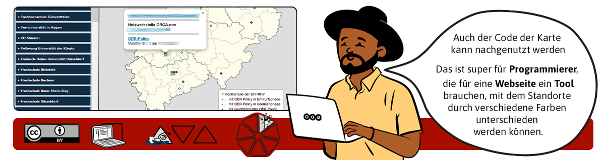
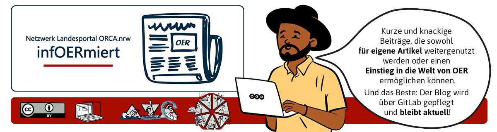
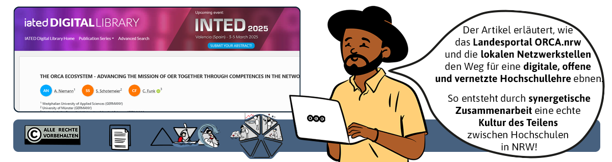
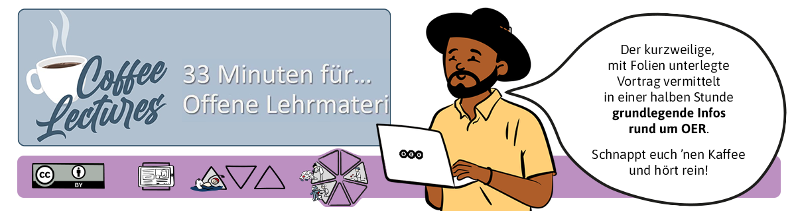

<!--
author:   Netzwerk ORCA.nrw
email:    your@mail.org

icon:     img/icon.png

version:  0.0.1

language: de

narrator: Deutsch Male

comment:  Material-Finder basierend auf dem Fischbestimmer von André Dietrich.

link:     style.css

@onload

const baseURL = (new URL("img", window.location.search.substr(1))).href

window["filter"] = {
  level: {
    beginner: null,
    praktiker: null,
    experte: null
  },

  praxiskategorie: {
    oer_finden: null,
    oer_herstellen: null,
    oer_lernen: null,
    oer_lehren: null,
    oer_einfuehren: null,
    oer_managen: null,
    oer_forschen: null
  },

  media: {
    audio: null,
    video: null,
    textdoc: null,
    selbstlernen: null,
    webseite: null,
    h5p: null,
    presentation: null,
    graphik: null
  }
}

@end

-->

# Material-Finder | Output Netzwerk ORCA.

Willkommen beim Output des Netzwerk ORCA.nrw!  

Das **Netzwerk ORCA.nrw** hat während seiner Projektlaufzeit (2020 bis 2024) zahlreiche Materialien rund um offene Bildungsmaterialien (OER) entwickelt und gesammelt. Ziel war es, Lehrende und Lernende dabei zu unterstützen, OER in der Praxis einzusetzen und weiterzuentwickeln. 
Diese Sammlung bietet Ihnen Orientierung und Ideen: **Einsteiger:innen** finden einen leichten Zugang zum Thema OER, **Praktiker:innen** Vorlagen und Muster zur Nachnutzung, und **Expert:innen** können sich inspirieren lassen oder neue Anknüpfungspunkte entdecken. Wir betrachten diese Rollen als fließend – entscheiden Sie situativ und nutzen Sie die Materialien so, wie es für Sie passt! 

Transparenz liegt uns am Herzen: Nicht alle Materialien, die das Netzwerk produziert hat, stehen unter freier Lizenz. Einige verlinken wir trotzdem, um sie sichtbar zu machen und so für mehr Offenheit in der Bildungslandschaft zu sorgen.
Stöbern Sie durch die Medientypen oder nutzen Sie die Suchfunktion, um gezielt nach Materialien zu suchen. „Wenn die Suche Sie überrascht oder herausfordert freuen wir uns über Ihre Gedanken, um sie noch besser gestalten zu können. 

Und nun: Viel Spaß beim Entdecken und Ausprobieren! Wir  freuen uns über Rückmeldungen, Feedback und Kommentare aller Art! 
**Spread the wOERd!**

![Willkommen beim Output des Netzwerk ORCA.nrw! Während der Projektlaufzeit (2019-2024) sind zahlreiche Materialien rund um offene Bildungsmaterialien (OER) entwickelt und gesammelt. Ziel war es, Lehrende und Lernende dabei zu unterstützen, OER in der Praxis einzusetzen und weiterzuentwickeln. Diese Sammlung bietet  Orientierung und Ideen für einen leichten Zugang zum Thema OER, umfasst Vorlagen und Muster zur Nachnutzung, und eine Menge Inspiration und neue Anknüpfungspunkte, um neue Perspektiven zu erkunden. Wir betrachten diese Rollen als fließend – entscheiden Sie situativ und nutzen Sie die Materialien so, wie es für Sie passt! Stöbern Sie durch die Medientypen oder nutzen Sie die Suchfunktion, um gezielt nach Materialien zu suchen. „Wenn die Suche Sie überrascht oder herausfordert freuen wir uns über Ihre Gedanken, um sie noch besser gestalten zu können. Viel Spaß beim Entdecken und Ausprobieren!](Bilder/Header.png "Fig. 1: Herzlich willkommen - Jamal für das Netzwerk ORCA.nrw")

 Level 

__Level__

@[button(level,beginner,Einsteiger)](Bilder/L-Einsteiger-150x130px.png)
@[button(level,praktiker,Praktiker)](Bilder/L-Praktiker-150x75px.png)
@[button(level,experte,Experte)](Bilder/L-Experte-150x130px.png)

---

 Praxiskategorie 

__Praxiskategorie__

@[button(praxiskategorie,oer_finden,OER finden)](Bilder/OER-finden-100x75.png)
@[button(praxiskategorie,oer_herstellen,OER herstellen)](Bilder/OER-herstellen-100x75.png)
@[button(praxiskategorie,oer_lernen,Mit OER lernen)](Bilder/OER-lernen-100x75.png)
@[button(praxiskategorie,oer_lehren,Mit OER lehren)](Bilder/OER-lehren-100x75.png)
@[button(praxiskategorie,oer_einfuehren,OER einführen)](Bilder/OER-einfuehren-100x75.png)
@[button(praxiskategorie,oer_managen,OER managen)](Bilder/OER-managen-100x75.png)
@[button(praxiskategorie,oer_forschen,Über OER forschen)](Bilder/OER-erforschen-100x75.png)

---

__Medienart__

@[button(media,audio,Audio)](Bilder/M-1.png)
@[button(media,video,Video)](Bilder/M-Video-75x75.png)
@[button(media,textdoc,Textdokument)](Bilder/M-Textdoc-75x75.png)
@[button(media,selbstlernen,Selbstlernkurs)](Bilder/M-Selbstlernmaterialien-75x75.png)
@[button(media,webseite,Webseite)](Bilder/M-Webseiten-75x75.png)
@[button(media,h5p,H5P)](Bilder/M-H5P-75x75.png)
@[button(media,presentation,Praesentation)](Bilder/M-PraesiInterview-75x75.png)
@[button(media,presentation,Bilder/Grafik)](Bilder/M-Grafiken-75x75.png)

---

---

## Webseiten

Hier sammeln sich digitale, code-basierte Ressourcen (vor allem HTML und Markdown-basiert), wie Blogs oder Git-Hub-Repositorien.

---

### OER Policy‐Karte und Karte der Netzwerkstellen in NRW
`Webseite` 
Die Karte zeigt **Hochschulstandorte** der DH.nrw und kennzeichnet solche, die eine **OER Policy veröffentlicht** haben.  
 
`Medienformat` HTML  
`erstellt/bearbeitbar mit` Web-Editor 
`Niveaustufe(n)` Einsteiger (Starter)  
`Praxiskategorie(n)`OER managen 
`Metadaten` Karte; HTML; Farbschema; OER-Policy; DH.nrw 

>***Zitationsvorschlag nach TULLU-Regel:***
>*OER Policy‐Karte und Karte der Netzwerkstellen in NRW; von Wenzel, Marko; Homp, Frank; [CC BY 4.0](https://creativecommons.org/licenses/by/4.0); Link führt zu [Twillo](https://www.twillo.de/edu-sharing/components/render/1b355de9-849c-44ab-a219-42c325748eee)*

---

### infOERmiert ‐ Der OER‐Blog vom Netzwerk Landesportal ORCA.nrw
Der `Blog` enthält **kurze informative Beiträge rund um OER**, die ursprünglich in der zugangsbeschränkten Community of Practice auf ORCA.nrw veröffentlicht wurden. **Der Blog bleibt offen und wird fortlaufend erweitert**.  
 
**`Medienformat`** E-Book, PDF, HTML **`erstellt/bearbeitbar mit`** Web-Editor  
**`Niveaustufe(n)`** Einsteiger (Starter), Praktiker, Experte 
**`Praxiskategorie(n)`** OER finden; OER herstellen; mit OER Lernen, mit OER lehren, OER einführen, OER managen, über OER forschen 
**`Metadaten`** OER; ORCA.nrw; Materialtipp; Praxiswerkstatt; Creative Commons; CC-Lizenz; Lizenzhinweis; OER-Policy; OER-Content 

>***Zitationsvorschlag nach TULLU-Regel:***
>*infOERmiert ‐ Der OER‐Blog vom Netzwerk Landesportal ORCA.nrw.; von Netzwerk Landesportal ORCA.nrw; [CC BY 4.0](https://creativecommons.org/licenses/by/4.0/); Link führt zu [OERSI](https://oersi.org/resources/aHR0cHM6Ly9saW5kYWhhbG0taHNiaS5naXRodWIuaW8vaW5mT0VSbWllcnQ= )*

---

### Open Educational Resources in der Japanologie
Der auf der 'Projektwebseite' verfügbare Vortrag „Open Educational Resources (OER) und ihr Potenzial für die Japanologie“ bot einen umfassenden Überblick über verschiedene online verfügbare Materialien für Studierende und Forschende der Japanologie, von vollständigen Kursen, Videos und Büchern bis hin zu Materialien von Museen und japanischen Sprachressourcen wie dem Kyoto University OpenCourseWare. Abschließend gab sie einen kurzen Überblick über den aktuellen Stand der OER-Angebote in der Japanologie, führte potenzielle Ressourcen für das Fach auf und skizzierte Best-Practice-Leitlinien zur Förderung von OER und offener Wissenschaft.  
 
**`Medienformat`** HTML, Präsentation **`erstellt/bearbeitbar mit`** unbekannt  
**`Niveaustufe(n)`** Einsteiger (Starter) 
**`Praxiskategorie(n)`** OER finden; OER hersellen; mit OER lernen; mit OER lehren; OER einführen 
**`Metadaten`** Open Educational Resources; OER; Japanologie; Creative Commons; Kultur des Teilens; Digitale Lehrmaterialien; Digitale Lernmaterialien; Bildungsmaterialien 

>***Zitationsvorschlag nach TULLU-Regel:***
>*Open Educational Resources in der Japanologie; von Scherer, Elisabeth; [CC BY SA 4.0](https://creativecommons.org/licenses/by-sa/4.0/); Link führt zu [Projektwebseite JVMG](https://jvmg.iuk.hdm-stuttgart.de/2022/09/07/presenting-at-the-18-deutschsprachigen-japanologentag/)*

### OER-Policy Kit
Das über 'LiaScript' bereitgestellte Policy Kit ist ein Leitfaden, der **in sieben Schritten** die Entwicklung einer OER-Policy beschreibt und **zusätzliche Materialien und Erläuterungen für Beauftragte im Erstellungsprozess** dazu bereitstellt. Dabei wird der Tatsache Rechnung getragen, dass jeder Entwicklungsprozess einer Policy - mit speziellem Blick auf den **Hochschulbereich** individuell ist und flexibel abläuft.  
 

**`Medienformat`** PDF, Textdatei **`erstellt/bearbeitbar mit`** Texteditor, Markdown  
**`Niveaustufe(n)`** Praktiker, Experte 
**`Praxiskategorie(n)`** OER einführen, OER managen 
**`Metadaten`** OER-Policy; Hochschule; Leitfaden; Prozessentwicklung; Materialien 

>***Zitationsvorschlag nach TULLU-Regel:***  
>*OER-Policy Kit; von Dreyer, Astrid; Hörmann, Irina; Homp, Frank; Legler, Stefanie; Czerwinski, Silvia; Loose, Yulia; [CC BY-SA 4.0](https://creativecommons.org/licenses/by-sa/4.0); Link führt zu [twillo](https://www.twillo.de)*

---
---

## Selbstlern-Materialien
Diese Kategorie enthält interaktive Inhalte, wie Selbstlernkurse und Übungen, die Informationen zu OER vermitteln wollen und dabei Lernen in eigenem Tempo ermöglichen. Vor allem eine Kategorie für Einsteiger:innen, aber auch für Praktiker:innen als Inspiration oder Vorlage für eigene Materialien.

---

### OER‐Glossar   
Dieses `Nachschlagewerk` erläutert **52 zentrale Begriffe** rund um das Thema Open Educational Resources (OER).   
Stand: August 2023   
 
***`Medienformat:`*** *Selbstlernkurs* ***`erstellt/bearbeitbar mit:`*** *ILIAS; Moodle, HTML*  
***`Niveaustufe(n):`*** *Einsteiger (Starter); Praktiker; Experte*  
***`Praxiskategorie(n)`*** *tbd* 
***`Metadaten:`*** *Urheberrecht; Werk; Barrierefreiheit; Zitat; Untertitel; Creative Commons; Lizenz; CC; Lehre, Repositorium*

> ***Zitationsvorschlag nach TULLU-Regel:***   
> *OER‐Glossar; von Gödecke, Svenja; Halm, Linda; Homp, Frank; Kobusch, Alexander; Schaffeld, Laura; Spaude, Magdalena; Weber, Tassja; [CC BY 4.0](https://creativecommons.org/licenses/by/4.0/); Link führt zum [ILIAS der Uni zu Köln](https://www.edulabs.uni‐koeln.de/goto.php?target=crs_2218&client_id=iliasedulabs)*

---

### OER-Wissenspool
Der `Selbstlernkurs` vermittelt in fünf Kategorien **Basiswissen zu Open Educational Resources** mit NRW-spezifischen Empfehlungen. Zudem enthält er eine OER-Bibliothek und einen Bereich für **OER-Showcases**. Der Kurs kann auf die eigene Insitution angepasst werden. Es stehen **Installationsanleitungen** zur Einbindung ins eigene LMS zur Verfügung.  
 
**`Medienformat`** Selbstlernkurs **`erstellt/bearbeitbar mit`** Ilias, Moodle, H5P  
**`Niveaustufe(n)`** Einsteiger (Starter), Praktiker 
**`Praxiskategorie(n)`** OER finden, OER herstellen, mit OER lernen, mit OER lehren 
**`Metadaten`** OER erstellen; H5P; OER Basiswissen; OER-Supportmaterial 

>***Zitationsvorschlag nach TULLU-Regel:***
>*OER-Wissenspool; von Nitzsche, Sina; Halm, Linda; [CC BY 4.0](https://creativecommons.org/licenses/by/4.0/); Link führt zu [Twillo](https://www.twillo.de/edu-sharing/components/render/2345cca5-7ef3-4a5c-90cb-1433b3401b47)*

---

### Learning Snacks: "ORCA.nrw: A University Network for OER" 
`Lernspiel` `Edu-Game`:
The example is based on a German network. You can find out **how the network works** and how it **advises on OER** together with the teacher Dr Jamal Groenstein, who gets to know the network as a protagonist.  
 
***`Medienformat:`*** *interaktive Web-Anwendung* ***`erstellt/bearbeitbar mit:`*** *Webanwendung [LearningSnacks](https://www.learningsnacks.de)*  
***`Niveaustufe(n):`*** *Einsteiger (Starter); Praktiker*  
***`Praxiskategorie(n)`*** *OER finden; OER herstellen; mit OER lernen; mit OER lehren; OER einführen; OER managen* 
***`Metadaten:`*** *OER; OER consultation; OER network; University; Higher Education*
> ***Zitationsvorschlag nach TULLU-Regel:***   
> *Learning Snacks: "ORCA.nrw: A University Network for OER"; von *Eube, Cornelia; Kobusch, Alexander; Niemann, Andrea; Nitzsche, Sina; Scherer, Elisabeth; Spaude, Magdalena*; [CC BY‐SA 4.0](https://creativecommons.org/licenses/by‐sa/4.0/); Link führt zu *[Learning Snacks](https://www.learningsnacks.de/share/218584/)*

                                                                                                                                                                                               
                                                                                                                                                                                               
---

### Lehre und Lernen öffnen: Open Educational Resources (OER) - OpenRUB
Der ‘Moodle-Kurs‘ bietet Lehrenden, Studierenden und allen Interessierten einen **Einstieg** in die Welt der Open Educational Resources (OER) und die Nutzung von Creative Commons-Lizenzen. Der Kurs besteht aus **drei unabhängig voneinander bearbeitbaren Abschnitten**: Einführung in OER, Erklärung von CC-Lizenzen und Empfehlungen zur Öffnung von Lehre und Lernen, speziell an der Ruhr-Universität Bochum. In einer Bearbeitungszeit von je 15 bis 20 Minuten pro Einheit lernen die Teilnehmenden, wie sie **OER finden, nutzen, erstellen und ihre eigenen Inhalte für eine offene Lehre gestalten** können.  
 
**`Medienformat`** Moodle-Kurs **`erstellt/bearbeitbar mit`** Moodle  
**`Niveaustufe(n)`** Einsteiger 
**`Praxiskategorie(n)`** OER finden, OER herstellen, mit OER lernen; mit OER lehren, OER einführen 
**`Metadaten`** OER; Open Educational Resources; Lehren; Lernen; Creative Commons; Lizenzen 

>***Zitationsvorschlag nach TULLU-Regel:***
>*Lehre und Lernen öffnen: Open Educational Resources (OER) - OpenRUB; von Fuchs, Michael; Ergänzungen von: Braungardt, Kathrin; Görlich, Sarah; [CC BY SA 4.0](https://creativecommons.org/licenses/by-sa/4.0/); Link führt zu [Moodle RUB](https://moodle.ruhr-uni-bochum.de/course/view.php?id=21966)*

---
---

## Textdokumente
Egal ob Leitfäden, Checklisten oder Handreichungen – Hier bündelns sich fundierte Informationen. Perfekt für Recherche und als Quelle, Ergänzung oder Vorlage für eigene Arbeiten.

---

### Aufzeichnung von Online-Konferenzbeiträgen als OER: Ein Praxisleitfaden
Das `Textdokument` gibt **Vortragenden** wertvolle Tipps und Tricks für die **Vorbereitung, Durchführung** und **Nachbereitung** einer digitalen Veranstaltung, die aufgezeichnet werden und anschließend als OER veröffentlicht werden kann.  
 
**`Medienformat`** PDF, Textdokument **`erstellt/bearbeitbar mit`** MS Word  
**`Niveaustufe(n)`** Einsteiger (Starter), Praktiker 
**`Praxiskategorie(n)`** OER herstellen, OER einführen; OER managen 
**`Metadaten`** Online-Veranstaltung; Hochschuldidaktik; Leitfaden; Videoproduktion; OER-Fachtag; Konferenzorganisation; Dokumentation; Digitalisierung 

>***Zitationsvorschlag nach TULLU-Regel:***
>*Aufzeichnung von Online-Konferenzbeiträgen als OER: Ein Praxisleitfaden; von Geurden, Bianca; Görlich, Sarah; Hützen, Nicole Hützen, Jahn, Markus; Mendez Parente, Josefine; Nitzsche; Sina; [CC BY 4.0](https://creativecommons.org/licenses/by/4.0/); Link führt zu [Twillo](https://www.twillo.de/edu-sharing/components/render/d7d698e4-d9e9-47fb-87e4-86283206c982)*

---

### Checkliste Open Educational Resources erstellen (v2.0)
Der Zweck dieses `Textdokuments` / Leitfadens ist, Lehrenden eine **Orientierung** zu geben, welche **rechtlichen Maßgaben** sie einhalten müssen und nach welchen **Qualitätsmerkmalen** sie OER-Materialien entwickeln und beurteilen können.

**`Medienformat`** PDF
Textdokument **`erstellt/bearbeitbar mit`** MS Word  
**`Niveaustufe(n)`** Einsteiger (Starter) 
**`Praxiskategorie(n)`** OER herstellen, OER managen 
**`Metadaten`** OER; Urheberrecht; Barrierefreiheit; Persönlichkeitsrecht; Produktion, Qualität 

>***Zitationsvorschlag nach TULLU-Regel:***
>*Checkliste Open Educational Resources erstellen (v2.0); von Kobusch,Alexander; Halm, Linda; [CC BY 4.0](https://creativecommons.org/licenses/by/4.0/); Link führt zu [Twillo](https://www.twillo.de/edu-sharing/components/render/6c1f1da2-7ff6-4dd6-b87b-0404b980cc50)*

---

### Handreichung: Veröffentlichung von Lehr-Lern-Materialien als OER
Das `Textdokument` wurde für Lehrende der HHU erstellt, kann aber **leicht für andere (Hochschul-) Kontexte angepasst werden**. Es enthält **kompakte Informationen** zu Creative-Commons-Lizenzen und **Tipps** rund um das Urheberrecht zur Publikation von Materialien als OER.  
 
**`Medienformat`** PDF, Textdokument **`erstellt/bearbeitbar mit`** MS Word  
**`Niveaustufe(n)`** Praktiker 
**`Praxiskategorie(n)`**  OER herstellen 
**`Metadaten`** OER; Creative Commons; Lehrmaterialien; E-Learning; Open Educational Resources 

>***Zitationsvorschlag nach TULLU-Regel:***
>*Handreichung: Veröffentlichung von Lehr-Lern-Materialien als OER; von Scherer, Elisabeth; [CC BY‐SA 4.0](https://creativecommons.org/licenses/by‐sa/4.0/); Link führt zu [Twillo](https://www.twillo.de/edu-sharing/components/render/53d9ee69-384c-4ddb-bfc3-a906197f5252)*

---

### Handreichung: Schwerpunkt Nutzung und Einbettung von nicht offen lizenzierten Materialien
Der Schwerpunkt des `Textdokuments` liegt auf dem **Nutzen und Einbetten von nicht offen lizensierten Materialien**, die damit zunächst nicht ausdrücklich zur freien Weiterverwendung freigegeben sind. Die Handreichung ist an alle gerichtet, die OER-Material erstellen und diese auf einer (evtl. öffentlich zugänglichen) Plattform **veröffentlichen** wollen.  
 
**`Medienformat`** PDF, Textdokument **`erstellt/bearbeitbar mit`** MS Word  
**`Niveaustufe(n)`** Praktiker 
**`Praxiskategorie(n)`** OER herstellen 
**`Metadaten`** Handreichung; Landesportal ORCA.nrw; Material erstellen; Creative-Commons-Lizenz; Lizenz vergeben; CC-Lizenz 

>***Zitationsvorschlag nach TULLU-Regel:***
>*Handreichung: Schwerpunkt Nutzung und Einbettung von nicht offen lizenzierten Materialien; von Josupeit, Christina; Funk, Christian; Anderheide, Marie-Sophie; Meyer, Elisabeth; [CC BY 4.0](https://creativecommons.org/licenses/by/4.0/); Link führt zu [Twillo](https://www.twillo.de/edu-sharing/components/render/1ead1f94-6298-41e6-92c0-d11c30bb19a3)*

---

### ORCA.nrw: Strategische Ansätze zur Entwicklung von OER-Policies an Hochschulen in NRW 

Das 'Kurzportrait' zum Landesportal ORCA.nrw bringt die Vorzüge der sozio-technischen Infrastrukturmaßnahme auf den Punkt.  
 
**`Medienformat`** PDF; Konferenz-Beitrag (Publikation) **`erstellt/bearbeitbar mit`** PDF-Editor  
**`Niveaustufe(n)`** Einsteiger, Praktiker 
**`Praxiskategorie(n)`** OER einführen, OER managen 
**`Metadaten`** Open Educational Resources; OER; Strategie; Policy; OER-Policy; NRW 

>***Zitationsvorschlag nach TULLU-Regel:***
>*ORCA.nrw: Strategische Ansätze zur Entwicklung von OER-Policies an Hochschulen in NRW. ; von Kobusch, Alexander; Halm, Linda; Nitzsche, Sina; Scherer, Elisabeth; Görlich, Sarah; Hörman, Irina; Liebscher, Julia; Schaffeld, Laura; [CC BY SA 4.0](https://creativecommons.org/licenses/by-sa/4.0/); Link führt zu [HFD](https://hochschulforumdigitalisierung.de/sites/default/files/dateien/SD_03_Einzel.pdf)*

---

### Das Landesportal ORCA.nrw. Eine Plattform – 37 Hochschulen – ein Netzwerk

Der 'Beitrag' beleuchtet die **Entwicklung des Landesportals ORCA.nrw**, das eine zentrale Plattform für Open Educational Resources (OER) für Hochschulen in Nordrhein-Westfalen bereitstellt. Ziel ist es, durch eine **gemeinschaftlich getragene Infrastruktur** Lehrmaterialien, Informationen und Services digital zugänglich zu machen und die **Zusammenarbeit zwischen Hochschulen** zu fördern. Die **lokale Vernetzung und institutionelle Begleitung** der Lehrenden unterstützen die Nutzung und Erstellung von OER und tragen zur digitalen Transformation im Bildungsbereich bei.  
 
**`Medienformat`** PDF, Tagungsbeitrag (Publikation) **`erstellt/bearbeitbar mit`** PDF-Editor  
**`Niveaustufe(n)`** Praktiker, Experte 
**`Praxiskategorie(n)`** "oer_managen": true, 
**`Metadaten`** OER; Zusammenarbeit; Digitalisierung der Hochschullehre; Netzwerk; ORCA.nrw; Community-Building 

>***Zitationsvorschlag nach TULLU-Regel:***
>*Das Landesportal ORCA.nrw. Eine Plattform – 37 Hochschulen – ein Netzwerk; von Eube, Cornelia; Kobusch, Alexander; Rosenthal, Florian; Scherer, Elisabeth; Spaude, Magdalena; [CC BY NC ND 4.0](https://creativecommons.org/licenses/by-nc-nd/4.0/); Link führt zu [Zenodo](https://zenodo.org/records/5004445)*

---

### The ORCA Ecosystem – Advancing the mission of OER together through competences in the network
Der **Artikel in englischer Sprache** beleuchtet das  Projekt ORCA.nrw, das als digitales Landesportal für Hochschulen in NRW **offene Bildungsressourcen (OER)** sowie **zielgruppenspezifische Informationen und Services** bereitstellt. ORCA.nrw vereint die Digitalisierungsprojekte der Hochschulen in einer gemeinsamen technischen und personellen Infrastruktur. Die **lokalen Netzwerkstellen** an den Hochschulen fördern die Nutzung und Integration der Angebote in die Lehre und stärken durch ihre Zusammenarbeit die Innovationskraft im ORCA-Ökosystem.  
 
**`Medienformat`** PDF; Konferenz-Beitrag (Publikation) **`erstellt/bearbeitbar mit`** PDF-Editor  
**`Niveaustufe(n)`** Einsteiger (Starter), Praktiker, Experte
**`Praxiskategorie(n)`** Oer finden, OER einführen, OER managen, zu OER forschen
**`Metadaten`** Open Educational Resources; OER; network; portal; digital transformation; ecosystem; local network points; culture of sharing; Offene Bildungsressourcen; OER; Digitale Transformation; Ökosystem; Netzwerk; Kultur des Teilens; Infrastruktur 

>***Zitationsvorschlag nach TULLU-Regel:***
>*The ORCA Ecosystem – Advancing the mission of OER together through competences in the network.; von Niemann, Andrea; Schotemeier, Sarah;  Funk, Christian; alle Rechte vorbehalten; Link führt zu [iated Digital Library](https://library.iated.org/view/NIEMANN2022ORC)*

---

### OER in NRW - Was motiviert? Was hindert? Ergebnisse einer Umfrage zur Nutzung, Produktion und Veröffentlichung von Open Educational Resources an Hochschulen
Diese ‘Publikation‘ präsentiert Ergebnisse einer Umfrage unter Hochschul-Lehrenden in NRW aus 2021, die Motivationen und Hürden rund um OER untersucht. Im Hochschulbereich lässt sich seit einiger Zeit. In NRW steht dafür das Landesportal ORCA.nrw zur Verfügung, das **Lehrende und Studierende** im Hochschulbereich unterstützt, an der beobachtbar zunehmenden Bedeutung und Förderung von offen lizenzierten Bildungsressourcen (OER) zu partizipieren. Befragt wurden **167 Teilnehmende** zu ihrer **Nutzung**, **Produktion** und **Veröffentlichung** von OER sowie ihren Unterstützungsbedarfen. Als **zentrale Motivation** zeigt sich eine positive Einstellung zum Teilen, aber auch finanzielle Anreize werden als wichtig angesehen. Als **größte Herausforderung** werden Kenntnisse zu OER, vor allem zu den rechtlichen Rahmenbedingungen, in allen OER-Handlungsbereichen offenbar.  
 
**`Medienformat`** PDF **`erstellt/bearbeitbar mit`** PDF-Editor  
**`Niveaustufe(n)`** Einsteiger (Starter), Praktiker 
**`Praxiskategorie(n)`** OER einführen, OER managen, zu OER forschen 
**`Metadaten`** OER Produktion; NRW; Netzwerkstellen; OER Umfrage; Hochschullehrende; Motivation; OER Teilen; OER Veröffentlichung; OER Nutzung; Perspektiven auf OER 

>***Zitationsvorschlag nach TULLU-Regel:***
>*OER in NRW - Was motiviert? Was hindert? Ergebnisse einer Umfrage zur Nutzung, Produktion und Veröffentlichung von Open Educational Resources an Hochschulen; von Geurden, Bianca; Jahn, Markus; Josupeit, Christina; Schotemeier, Sarah; Weber, Tassja (unter Mitarbeit von Schäfer, S. (Fragebogen und Teilauswertung) und Krüger, A. (Teilauswertung)); [CC BY 4.0](https://creativecommons.org/licenses/by/4.0/); Link führt zu [Twillo](https://www.twillo.de/edu-sharing/components/render/89bad355-8af3-48c3-bf15-aa6163127039)*

---

### Das Potenzial freier Bildungsmaterialien
Die 'hochschuldidaktische Beilage', in der der Artikel erscheint, widmet sich **dem Potenzial und der Förderung von Open Educational Resources** (OER) in der Hochschullehre und hebt die Bedeutung einer **Kultur des Teilens** hervor. Lehrende profitieren von der kollaborativen Nutzung und Weiterentwicklung offen lizensierter Materialien. Die **Vernetzung und der Erfahrungsaustausch**, gefördert durch das Landesportal ORCA.nrw und die Community of Practice, stärken innovative Lehr- und Lernansätze.  
 
**`Medienformat`** PDF; Artikel-Beitrag (Publikation) **`erstellt/bearbeitbar mit`** PDF-Editor  
**`Niveaustufe(n)`** Einsteiger (Starter)
**`Praxiskategorie(n)`** mit OER lehren, OER einführen
**`Metadaten`** OER; Lehr-Lern-Kultur; Kulturwandel; Hochschuldidaktik; Potenzial; Open Educational Resources; Kultur des Teilens 

>***Zitationsvorschlag nach TULLU-Regel:***
>*Das Potenzial freier Bildungsmaterialien. ; von Hörmann, Irina; Scheele, Sandra; alle Rechte vorbehalten; Link führt zu [Webauftritt HS Niederrhein](https://www.hs-niederrhein.de/fileadmin/dateien/hll/hochschuldidaktik/LeNi-Beilage_in_der_NIU/Le_Ni_Beilage_2_Wandel_der_Lehr-_und_Lernkultur_durch_OER.pdf)*

---

### Lehr- und Lernmaterialien frei Haus: Open Educational Resources
Der ‘Beitrag‘ im Jahrbuch der FH Dortmund stellt **Open Educational Resources (OER)** vor und zeigt, wie frei verfügbare, lizenzierte Lehrmaterialien **den Hochschulalltag bereichern** können. Durch OER können Lehrende Inhalte flexibel nutzen, anpassen und teilen, was den **Wissensaustausch über Lehre fördert** fördert und Lernmaterialien einfach zugänglich macht. Ein besonderer Fokus liegt auf dem **Landesportal ORCA.nrw**, das Lehrenden und Studierenden in NRW eine **zentrale Anlaufstelle** für hochwertige, offene Bildungsmaterialien bietet.  
 
**`Medienformat`** E-Zine **`erstellt/bearbeitbar mit`** unbekannt  
**`Niveaustufe(n)`** Einsteiger (Starter) 
**`Praxiskategorie(n)`** mit OER lehren, OER einführen 
**`Metadaten`** Open Educational Resources; OER; Creative Commons Lizenzen; CC Lizenzen; Landesportal; ORCA.nrw; Austausch; Kultur des Teilens 

>***Zitationsvorschlag nach TULLU-Regel:***
>*„Lehr- und Lernmaterialien frei Haus: Open Educational Resources.“; von Nietzsche, Sina; [CC BY 4.0](https://creativecommons.org/licenses/by/4.0/); Link führt zu [Heyzine Flipbooks](https://heyzine.com/flip-book/11b57ddf01.html#page/169)*

---

### Sichtbarkeit von Open Educational Culture an Hochschulen
`Textdokument`: Open Educational Culture (OEC) bedeutet, dass Wissen und Ressourcen frei und offen geteilt werden, um den Bildungszugang für alle leichter zu machen. In diesen Texten wird aufgezeigt, wo eine solche Open Educational Culture an Hochschulen sichtbar wird und weshalb sie sinnvoll ist.  
 
**`Medienformat`** Word-Dokument **`erstellt/bearbeitbar mit`** MS Word  
**`Niveaustufe(n)`** Einsteiger (Starter), Praktiker, Experte 
**`Praxiskategorie(n)`** Mit OER lehren, OER managen, zu OER forschen 
**`Metadaten`** tbd 

>***Zitationsvorschlag nach TULLU-Regel:***
>*Sichtbarkeit von Open Educational Culture an Hochschulen; von Jahn, Markus; Kober, Sabine; Reichardt, Gabi; [CC BY 4.0](https://creativecommons.org/licenses/by/4.0/); Link führt zu [Twillo](https://www.twillo.de/edu-sharing/components/render/aa67b800-5e36-40bf-a4d0-590ec4f40b11 )*

---

### Unser Werteverständnis - Open Educational Culture
`Textdokument`zur Frage: Was bedeutet eine "Open Educational Culture" im Kontext von Open Educational Resources? Mit dieser Frage haben sich die Netzwerkstellen des Landesportals, im Kern eine Arbeitsgruppe zum Thema **Open Educational Culture**, seit Beginn des Jahres 2021 beschäftigt. Das Nachfolgende ist ein Ausdruck der **kondensierten Werte, Einstellungen und Verhaltensweisen**, die aus Sicht der Netzwerkstellen und gleichzeitigen OER-Expert:innen grundlegend sind, um eine Open Educational Culture (OEC) aktiv zu leben. Gerade das Vorleben dieser Werte (durch jede:n Einzelne:n) schafft neue Erfahrungsräume und fördert eine Open Educational Culture. Sie ermöglichen es jedoch auch, zu spüren und zu beobachten, wo im System der Hochschule und bei ihren jeweiligen Akteur*innen eine Open Educational Culture bereits stattfindet oder aber sich zu entwickeln beginnt. Die Schärfung des Verständnisses einer Open Educational Culture stellt letztlich eine gemeinsame Leitlinie im Themenfeld OER und im Handlungsfeld Lehre bereit.  
 
**`Medienformat`** PDF **`erstellt/bearbeitbar mit`** PDF-Editor  
**`Niveaustufe(n)`** Einsteiger (Starter), Experte 
**`Praxiskategorie(n)`** OER einführen, OER managen, zu OER forschen 
**`Metadaten`** tbd 

>***Zitationsvorschlag nach TULLU-Regel:***
>*Unser Werteverständnis - Open Educational Culture; von Geurden, Bianca; [CC BY 4.0](https://creativecommons.org/licenses/by/4.0/); Link führt zu [Twillo](https://www.twillo.de/edu-sharing/components/render/0aec2d6e-e83e-4124-91ee-39a2b2449e0c)*

---

### Den Bedenken zu OER begegnen
`Textdokument`: Wer darüber nachdenkt, Open Educational Resources (OER) selbst zu nutzen, zu bearbeiten oder neu zu erstellen, entdeckt schnell, dass es eine Reihe von technischen, inhaltlichen oder rechtlichen Bedenken hierzu geben kann. In diesem Text geht es darum, sie  aufzugreifen, zu beleuchten und ihnen konstruktiv zu begegnen. Aus der Diversität der Perspektiven auf das Thema resultieren unterschiedliche Herangehensweisen und Stilrichtungen in den einzelnen Kapiteln.  
 
**`Medienformat`** Word-Dokument **`erstellt/bearbeitbar mit`** PDF-Editor 
**`Niveaustufe(n)`** Einsteiger (Starter), Praktiker, Experte 
**`Praxiskategorie(n)`** OER einführen, OER managen, zu OER forschen 
**`Metadaten`** OER Produktion; Open Educational Culture; Kultur des Teilens; Rechtlicher Rahmen; KI; Bedenken begegnen; Persönliche Bedenken; OER-Inhalt; Technik 

>***Zitationsvorschlag nach TULLU-Regel:***
>*Den Bedenken zu OER begegnen; von Jahn, Markus; Kober, Sabine; Schotemeier, Sarah;  Schütgens; Robin; [CC BY 4.0](https://creativecommons.org/licenses/by/4.0/); Link führt zu [Twillo](https://www.twillo.de/edu-sharing/components/render/6d7baa1b-07cf-497a-a10b-69e3deb0489d)*

---

### Trainingskonzept: Feedback zu OER geben mit dem OER-Feedbackrad
`Textdokument`: Mit dem OER-Feedbackrad trainieren Lehrende, sich gegenseitig zu einer selbst erstellten Open Educational Resource Feedback zu geben. Dabei können sie den Fokus im Gespräch auf unterschiedliche Kategorien legen. Alternativ kann hiermit zu einer gefundenen/bereitgestellten OER Feedback gegeben werden.  
 
**`Medienformat`** PDF **`erstellt/bearbeitbar mit`** PDF-Editor  
**`Niveaustufe(n)`** Einsteiger (Starter), Praktiker, Experte 
**`Praxiskategorie(n)`** OER herstellen, mit OER lehren, OER managen, zu OER forschen 
**`Metadaten`** Feedback; Feedbackkultur; OER-Feedbackrad; Open Educationals Culture; OEC; Kultur des Teilens; OER; Trainingskonzept 

>***Zitationsvorschlag nach TULLU-Regel:***
>*Trainingskonzept: Feedback zu OER geben mit dem OER-Feedbackrad; von Geurden, Bianca; [CC BY 4.0](https://creativecommons.org/licenses/by/4.0/); Link führt zu [Twillo](https://www.twillo.de/edu-sharing/components/render/f1ae38bf-aa63-4116-a607-dbd9ce02c0a5)*

---

### Wie Austauschformate zur Förderung einer Open Educational Culture an Hochschulen beitragen können
Diese `Handreichung` ist das Ergebnis einer Kooperation im Rahmen des Netzwerks, den OER-Expert:innen der NRW-Hochschulen, im Open Resources Campus NRW (ORCA.nrw). Hierbei widmen sich die OER-Expert:innen der Etablierung und Unterstützung einer Open Educational Culture an Universitäten, Hochschulen für Angewandte Wissenschaften sowie Musik- und Kunsthochschulen und geben **praktische Tipps und Anleitungen**, wie das gelingen kann. Das vorliegende Dokument, das Teil der Handlungsempfehlungen ist, beschäftigt sich mit dem Aspekt, wie **Austauschformate** zur Förderung einer Open Educational Culture an der Hochschule beitragen können. Es richtet sich primär an **OER-Multiplikator:innen**, die an ihren Bildungseinrichtungen eine **Open Educational Culture** fördern wollen.  
 
**`Medienformat`** PDF **`erstellt/bearbeitbar mit`** PDF-Editor  
**`Niveaustufe(n)`** Praktiker 
**`Praxiskategorie(n)`** OER finden, mit OER lehren, OER managen, zu OER forschen 
**`Metadaten`** OER; Open Educationals Cuture; Kultur des Teilens; Offenheit; Austauschformate; Beratung; Innovation; Diffusionstheorie 

>***Zitationsvorschlag nach TULLU-Regel:***
>*Wie Austauschformate zur Förderung einer Open Educational Culture an Hochschulen beitragen können; von Heckmann, Henrike; Hörmann, Irina; Jahn,  Markus; Méndez Parente, Josefine; [CC BY 4.0](https://creativecommons.org/licenses/by/4.0/); Link führt zu [Twillo](https://www.twillo.de/edu-sharing/components/render/528057a1-414b-4fd0-a39d-f49b10a3adaf )*

---
---

## Videos
Lernvideos, Vorträge und Interviews: In dieser Kategorie finden Sie visuelle Unterstützung zu Themen und Konzepten rund um OER. Die Materialien eignen sich sowohl zur Informationsvermittlung als auch zur Weitergabe an Kolleg:innen und Muliplikator:innen – ideal, um Inhalte lebendig und nachhaltig zu präsentieren.
---
### 33 Minuten für… Das Konzept der Open Educational Resources (OER)
Im `Video` zum Vortragsformat der **Coffee Lectures** lernen Sie das **Konzept von OER** kennen, erfahren, wo Sie **OER finden** und wie Sie selber die **eigenen Lehrmaterialien mit einer Creative-Commons-Lizenz teilen**.  
 
**`Medienformat`** Video **`erstellt/bearbeitbar mit`** Video-Schnittprogramme 
**`Niveaustufe(n)`** Einsteiger (Starter) 
**`Praxiskategorie(n)`** OER finden, OER herstellen, OER einführen 
**`Metadaten`** Creative Commons Lizenzen; CC-Lizenzen 

>***Zitationsvorschlag nach TULLU-Regel:***
>*33 Minuten für… Das Konzept der Open Educational Resources (OER); von Spaude, Magdalena; [CC BY 4.0](https://creativecommons.org/licenses/by/4.0/); Link führt zu [Opencast Uni zu Köln](https://player.opencast.uni-koeln.de/822648aa-2cba-422a-9df4-5f6acaede4b3)*

---

### Lernpause: Freie Bildungsressourcen (Open Educational Resources, OER)
In der 'Aufzeichung' der **LernPause** der **Universität Paderborn** zum Thema **OER**, werden **Merkmale von und Mehrwerte** OER im Vergleich zu traditionellen Lehr- und Lernmaterialien thematisiert, aufgezeigt auf wo Sie OER suchen/finden und in Ihrer Lehre einsetzen können. Zudem wird über Unterstützungsangebote zu OER an der Universität Paderborn informiert.  
 
**`Medienformat`** Video **`erstellt/bearbeitbar mit`** Video-Schnittprogramme  
**`Niveaustufe(n)`** Einsteiger (Starter) 
**`Praxiskategorie(n)`** OER finden, mit OER lehren, OER einführen 
**`Metadaten`** Lernpause; Hochschuldidaktik; E-Learning; elearning; e-Lehre; OER; Open Educational Resources 

>***Zitationsvorschlag nach TULLU-Regel:***
>*Freie Bildungsressourcen (Open Educational Resources, OER); von Weber, Tassja; alle Rechte vorbehalten; Link führt zu [Videoportal Universität Paderborn](https://videos.uni-paderborn.de/channel/video/LernPause-Oktober-2022-Freie-Bildungsressourcen-OpenEducational-Resources-OER/467e2204ae07d08774da3ae9565ade0d/27)*

---
---

## Audio

In diese Kategorie fallen sowohl Musikstücke als auch Podcasts und sonstige Tondokumente.

---
---

# Impressum
This template for OER courses is released under MIT. The content of the document is subject to the respective license as indicated at the end of the generated files or in the metadata.yml.

<article>

### Haftung für Links

Unser Angebot enthält Links zu externen Webseiten Dritter, auf deren Inhalte wir keinen Einfluss haben.
Deshalb können wir für diese fremden Inhalte auch keine Gewähr übernehmen.
Für die Inhalte der verlinkten Seiten ist stets der jeweilige Anbieter oder Betreiber der Seiten verantwortlich.
Die verlinkten Seiten wurden zum Zeitpunkt der Verlinkung auf mögliche Rechtsverstöße überprüft.
Rechtswidrige Inhalte waren zum Zeitpunkt der Verlinkung nicht erkennbar.
Eine permanente inhaltliche Kontrolle der verlinkten Seiten ist jedoch ohne konkrete Anhaltspunkte einer Rechtsverletzung nicht zumutbar.
Bei Bekanntwerden von Rechtsverletzungen werden wir derartige Links umgehend entfernen.

### Urheberrecht

ERstmal unterliegt der Inhalt dem deutschen Urheberrecht.
Die Vervielfältigung, Bearbeitung, Verbreitung und jede Art der Verwertung außerhalb der Grenzen des Urheberrechtes bedürfen der schriftlichen Zustimmung des jeweiligen Autors bzw. Erstellers.
Downloads und Kopien dieser Seite sind nur für den privaten, nicht kommerziellen Gebrauch gestattet.
Soweit die Inhalte auf dieser Seite nicht vom Betreiber erstellt wurden, werden die Urheberrechte Dritter beachtet.
Insbesondere werden Inhalte Dritter als solche gekennzeichnet.Sollten Sie trotzdem auf eine Urheberrechtsverletzung aufmerksam werden, bitten wir um einen entsprechenden Hinweis.
Bei Bekanntwerden von Rechtsverletzungen werden wir derartige Inhalte umgehend entfernen.

</article>
